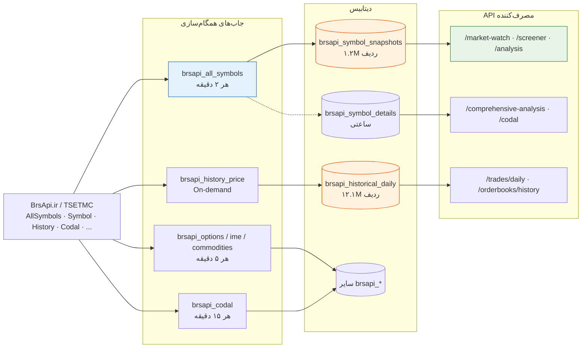

# 📊 گزارش کامل منابع داده BrsApi.ir / TSETMC

> تاریخ: ۲۰۲۶-۰۷-۲۷  
> آخرین بروزرسانی: فاز ۱ و ۲ معماری  
> وضعیت: مستندات جاری

---

## ۱. جدول کل Endpointهای API با منبع داده TSETMC/BrsApi

از مجموع **~۵۰ مسیر API** ثبت‌شده در Router، **۲۳ مسیر** مستقیماً از داده‌های BrsApi.ir/TSETMC استفاده می‌کنند.

### 🟢 بخش ۱: Real-time (هر ۲ دقیقه — از `brsapi_symbol_snapshots`)

| # | مسیر API | سرویس/متد | داده دریافتی |
|---|----------|-----------|-------------|
| 1 | `GET /market-watch` | `get_latest_snapshots(3000)` | قیمت، حجم، ارزش، حقوقی/حقیقی، سفارشات سطح ۱ |
| 2 | `GET /market-dashboard` | `get_enriched_snapshots(500)` | + tmin/tmax, P/E, EPS, شناوری، بازار |
| 3 | `GET /market/overview` | `get_latest_snapshots(100)` | ۱۰۰ نماد برتر به تفکیک ارزش |
| 4 | `GET /market/gainers` | `get_enriched_snapshots(500)` | پربازده‌ترین نمادها |
| 5 | `GET /market/heatmap` | `get_enriched_snapshots(500)` | هیت مپ صنایع |
| 6 | `GET /market-info` | BrsApiQueryService | اطلاعات تکمیلی بازار |
| 7 | `GET /analysis/*` (×۴) | `get_latest_snapshots(limit=500)` | تحلیل تکنیکال دسته‌جمعی |
| 8 | `GET /queue-analysis/{symbol}` | `get_enriched_symbol_detail()` | tmin, tmax, bid/ask + تاریخچه |
| 9 | `GET /queue-analysis/market` | `analyze_market(limit=500)` | آمار کلی صف‌های بازار |
| 10 | `GET /screener*` | `get_enriched_snapshots(limit=...)` | غربال‌گر هوشمند |
| 11 | `GET /screener-v2/*` (×۶) | `get_enriched_snapshots(limit=...)` | غربال‌گر پیشرفته |
| 12 | `GET /fundamental/*` | `get_latest_snapshots()` | تحلیل بنیادی |

**جدول:** `brsapi_symbol_snapshots` (← AllSymbols.php)  
**فرکانس:** هر ۲ دقیقه توسط job `brsapi_all_symbols`

---

### 🔵 بخش ۲: نیمه Real-time (هر ۲ تا ۵ دقیقه — enriched با SymbolDetail)

| # | مسیر API | سرویس/متد | داده دریافتی |
|---|----------|-----------|-------------|
| 13 | `GET /comprehensive-analysis/{symbol}` | `get_enriched_symbol_detail(symbol)` | + tmin, tmax, P/E, EPS, شناوری، market, state |
| 14 | `GET /codal/{symbol}` | BrsApiQueryService | enriched + اطلاعیه‌های کدال |
| 15 | `GET /stock-assistant/*` | BrsApiQueryService | داده‌های نماد برای دستیار |
| 16 | `GET /assistant/*` | BrsApiQueryService | داده برای دستیار یکپارچه |
| 17 | `GET /chat/*` | BrsApiQueryService | داده برای چت هوشمند |

**جدول:** `brsapi_symbol_snapshots` + `brsapi_symbol_details` (LEFT JOIN)  
**فرکانس:** SymbolDetail ساعتی آپدیت می‌شود (Job on-demand)

---

### 🟣 بخش ۳: سرویس‌های تخصصی با Fallback به Live API

| # | مسیر API | سرویس | داده دریافتی | Fallback |
|---|----------|-------|-------------|----------|
| 18 | `GET /orderbooks/{symbol}` | **OrderBookService** | ۵ سطح bid/ask از snapshot | Live BrsApi |
| 19 | `GET /orderbooks/history/{symbol}` | OrderBookService | تاریخچه از `brsapi_historical_daily` | — |
| 20 | `GET /trades/intraday/{symbol}` | **TradeService** | تیک‌های معاملاتی | Live BrsApi |
| 21 | `GET /trades/daily/{symbol}` | TradeService | خلاصه روزانه | — |
| 22 | `GET /macro/*` (×۳) | **MacroService** | کالا، طلا، ارز | Live API |

---

### 🟡 بخش ۴: BrsApi Raw Endpoints

| # | مسیر | داده |
|---|------|------|
| 23 | `GET /brsapi/commodities` | قیمت ۵۰+ کالای جهانی |
| 24 | `GET /brsapi/crypto` | ۱۰۰ رمزارز برتر |
| 25 | `GET /brsapi/gold-coins` | طلا، سکه، مثقال |
| 26 | `GET /brsapi/currencies` | ۲۰ جفت‌ارز اصلی |
| 27 | `GET /brsapi/indices` | شاخص کل، هموزن، فرابورس |
| 28 | `GET /brsapi/options` | قراردادهای آپشن |
| 29 | `GET /brsapi/historical-daily` | داده تاریخی بر اساس symbol |

**جدول‌ها:** `brsapi_commodity_prices`, `brsapi_crypto_prices`, `brsapi_gold_currency_pro`, `brsapi_index_values`, `brsapi_option_snapshots`, `brsapi_historical_daily`

---

## ۲. جدول فرکانس

**دیاگرام جریان داده (BrsApi → جاب‌ها → دیتابیس → API):**

 Synchronization

| Job BrsApi | فرکانس | جدول مقصد | وضعیت |
|------------|--------|-----------|--------|
| **brsapi_all_symbols** | ⏱️ **هر ۲ دقیقه** | `brsapi_symbol_snapshots` | ✅ فعال |
| **brsapi_index** (type=1/2) | ⏱️ **هر ۲ دقیقه** | `brsapi_index_values` | ✅ فعال |
| **brsapi_options** | ⏱️ **هر ۵ دقیقه** | `brsapi_option_snapshots` | ✅ فعال |
| **brsapi_ime_futures** | ⏱️ **هر ۵ دقیقه** | `brsapi_ime_futures` | ✅ فعال |
| **brsapi_commodities** | ⏱️ **هر ۵ دقیقه** | `brsapi_commodity_prices` | ✅ فعال |
| **brsapi_crypto** | ⏱️ **هر ۵ دقیقه** | `brsapi_crypto_prices` | ✅ فعال |
| **brsapi_gold_currency** | ⏱️ **هر ۵ دقیقه** | `brsapi_gold_currency_pro` | ✅ فعال |
| **brsapi_codal** | ⏱️ **هر ۱۵ دقیقه** | `brsapi_codal_announcements` | ✅ فعال |
| **brsapi_ime_physical** | ⏱️ **روزانه ۱۸:۰۰** | `brsapi_ime_physical_trades` | ✅ فعال |
| brsapi_nav | On-demand | `brsapi_nav_records` | 🔴 غیرفعال |
| brsapi_history_price | On-demand | `brsapi_historical_daily` | 🔴 غیرفعال |
| brsapi_history_real_legal | On-demand | `brsapi_historical_real_legal` | 🔴 غیرفعال |

---

## ۳. فیلدهای دریافتی از هر Endpoint TSETMC

### ۳.۱ AllSymbols.php (هر ۲ دقیقه) → `brsapi_symbol_snapshots`

| گروه | فیلدها |
|------|--------|
| **شناسه** | ins_id, symbol, name, isin, sector, sector_id |
| **بنیادی** | shares_count, base_volume, market_value, eps, pe_ratio |
| **قیمت** | price_min, price_max, price_yesterday, price_first, price_last, price_last_change, price_last_change_pct, price_close, price_close_change, price_close_change_pct |
| **معاملات** | trade_count, trade_volume, trade_value |
| **حقوقی/حقیقی** | buy_real_count, buy_legal_count, sell_real_count, sell_legal_count, buy_real_volume, buy_legal_volume, sell_real_volume, sell_legal_volume |
| **سفارشات (۵ سطح)** | bid_count_{1-5}, bid_volume_{1-5}, bid_price_{1-5}, ask_count_{1-5}, ask_volume_{1-5}, ask_price_{1-5} |

### ۳.۲ Symbol.php (On-demand) → `brsapi_symbol_details`

| گروه | فیلدهای اضافی |
|------|--------------|
| **شناسه تکمیلی** | code_12, code_5, code_4, market, board, board_id, board_code |
| **صنعت** | sub_sector, sub_sector_id |
| **بنیادی** | shares_issued, free_float_pct, group_pe_ratio, ps_ratio |
| **دامنه نوسان** | **price_lowest_allowed (tmin)**, **price_highest_allowed (tmax)** |
| **محدوده** | price_min_week, price_max_week, price_min_year, price_max_year |
| **وضعیت** | state, date_update, assembly |

---

## ۴. تحلیل: چه داده‌ای در FeatureEngine Real-time است؟

| بلوک ویژگی | تعداد | Real-time | توضیح |
|-----------|-------|-----------|--------|
| **A:** هویت و کیفیت داده | ۱۰ | ✅ ۶ از ۱۰ | ticker, isin, market از snapshot |
| **B:** بنیادی | ۱۵ | 🟡 ۳ از ۱۵ | EPS از snapshot (ساعتی) |
| **C:** ارزش‌گذاری | ۱۰ | ✅ ۵ از ۱۰ | P/E, قیمت از snapshot |
| **D:** تکنیکال | ۱۵ | ✅ ۱۲ از ۱۵ | حجم، قیمت، RSI, MACD محاسبه از historical |
| **E:** جریان پول | ۱۰ | ✅ ۸ از ۱۰ | حقوقی/حقیقی از snapshot |
| **F:** ریزساختار + صف | ۱۵ | ✅ ۱۰ از ۱۵ | سفارشات + queue از snapshot |
| **G:** رویدادها | ۲۰ | ❌ ۰ از ۲۰ | Placeholder — نیاز به کدال/اخبار |
| **H:** امتیازها | ۲۰ | ✅ ۲۰ از ۲۰ | محاسبه از سایر بلوک‌ها |

### 🟢 Real-time (لحظه‌ای): ۳۷ ویژگی
- قیمت‌ها، حجم، ارزش، سفارشات، حقوقی/حقیقی ← `brsapi_symbol_snapshots` (۲ دقیقه)
- queue status, queue volume ratio ← `QueueAnalysisService` (۲ دقیقه)

### 🟡 Semi Real-time (ساعتی): ۳۵ ویژگی
- P/E, EPS, tmin/tmax, شناوری، صنعت ← `brsapi_symbol_details` (ساعتی)

### 🔴 Placeholder (نیاز به توسعه): ۲۳ ویژگی
- Block B: accumulated_loss, registered_capital, gross_margin, net_profit
- Block D: farabourse_price, early_volume_ratio
- Block F: max_block_volume, code2code_buy/sell
- Block G: تمام ۲۰ ویژگی (کدال، اخبار، پایش)
- Block C: inflation_rate, usd_nima/free (hardcoded)

---

## ۵. وضعیت داده‌های QueueFeatures (جدید)

| ویژگی | وضعیت | منبع | تازگی |
|-------|-------|------|-------|
| queue_status | ✅ Real-time | `last_price >= limit_up` | ۲ دقیقه |
| queue_volume_ratio | ✅ Real-time | bid_volume_1 / (bid + sell) | ۲ دقیقه |
| queue_days_streak | 🟡 تخمینی | از `brsapi_historical_daily` (on-demand) | ساعتی |
| queue_type_change | ✅ Real-time | مقایسه queue_status امروز/دیروز | ۲ دقیقه |
| distance_to_limit | ✅ Real-time | `(limit_up - last_price) / last_price` | ۲ دقیقه |

---

## ۶. اولویت‌های توسعه برای Real-time کردن داده‌ها

| اولویت | داده | راه‌حل | تخمین |
|--------|------|--------|-------|
| **۱** | History Price job | فعال‌سازی `brsapi_history_price` برای همه نمادها | ۱ روز |
| **۲** | History Real/Legal job | فعال‌سازی `brsapi_history_real_legal` | ۱ روز |
| **۳** | EPS دقیق | اتصال به Codal Financial Statements | ۲ روز |
| **۴** | Block G رویدادها | Parsing `brsapi_codal_announcements` + خبر | ۳ روز |
| **۵** | Macro constants | API بانک مرکزی / منابع کلان | ۲ روز |
