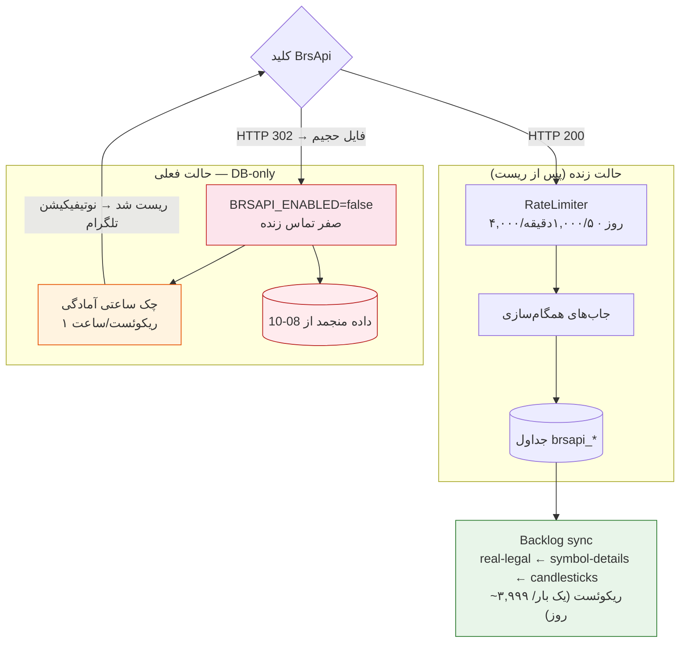

# 📊 گزارش وضعیت Sync برسپی (BrsApi)

> **تاریخ تولید گزارش:** 2026-08-12
> **منبع داده:** کوئری مستقیم از دیتابیس (`brsapi_*` tables + `brsapi_sync_log`)

---

## 🔴 وضعیت کلید




 BrsApi

| مورد | وضعیت |
|---|---|
| کلید (پلن) | فعال — انقضا ۱۴ آذر |
| شمارنده مصرف سمت سرور | ❌ **هنوز بالای آستانه** — هر درخواست زنده `HTTP 302` به یک فایل حجیم برمیگردد |
| حالت فعلی پلتفرم | `BRSAPI_ENABLED=false` (DB-only) — هیچ تماس زندهای زده نمیشود |
| چک ساعتی آمادگی | ✅ فعال — به محض ریست شمارنده (HTTP 200) تلگرام خبر میدهد |

> ⚠️ **نتیجه:** هیچ sync زنده و جدیدی اجرا نشده. آخرین داده واقعی برسپی مربوط به **08-10** (روز مسدودی) است.

---

## 📋 تازگی جداول (مقادیر واقعی دیتابیس)

| جدول | ردیف | نماد | آخرین بهروزرسانی | وضعیت |
|---|---|---|---|---|
| `brsapi_symbol_snapshots` | 1,194,116 | 1,920 | 08-10 10:30 | ⚠️ منجمد از روز مسدودی |
| `brsapi_symbol_details` | 3,969 | 1,442 | 08-10 07:05 | ⚠️ منجمد |
| `brsapi_candlesticks` | 2,262,218 | 1,111 | 08-10 14:05 | ⚠️ منجمد (~800 نماد باقیمانده از بکفیل) |
| `brsapi_historical_daily` | 12,112,238 | 1,940 | 08-10 14:05 | ⚠️ منجمد |
| `brsapi_historical_real_legal` | 909,684 | 559 | **08-05 04:49** | 🔴 عقبافتادهترین (اولویت 1) |
| `brsapi_shareholder_records` | 777,313 | 1,906 | 08-10 14:05 | ⚠️ منجمد |
| `brsapi_index_values` | 4,057 | 8 | 08-10 08:59 | ⚠️ منجمد |
| `brsapi_intraday_trades` | 1,637,033 | 68 | 08-10 12:57 | ⚠️ منجمد |
| `brsapi_option_snapshots` | 505,155 | 1,505 | 08-10 12:27 | ⚠️ منجمد |
| `screener_daily_scores` | 1,533 | 511 | **08-12 08:05** | ✅ تازه (DB-only، بدون API) |
| `ml_engineered_features` | 3 | 3 | 08-11 09:44 | ⚠️ فقط 3 نماد (فولاد، خودرو، وبملت) |

---

## 📜 لاگ Sync (`brsapi_sync_log` — 47,390 رکورد)

### آخرین ورودیهای موفق
| زمان | endpoint | وضعیت | آیتم |
|---|---|---|---|
| 08-12 08:05 | `screener_daily_scores` | OK | 511 |
| 08-12 08:03 | `screener_daily_scores` | OK | 511 |

> اینها اسکریپتهای DB-only هستند (ساخت امتیاز از دیتابیس، بدون مصرف API).

### خطاهای اخیر (08-11)
تمام jobهای زنده (`/Market/Commodity.php`, `/Market/Cryptocurrency.php`, `/IME/Fund.php`) با **error** fail-fast شدهاند — رفتار صحیح محافظت از کلید هنگام مسدودی. ✅

---

## 🎯 جمعبندی و اقدام

| مورد | وضعیت |
|---|---|
| دادههای قیمتی/کندل/سهامدار/ایندکس | کامل تا 08-10 — بعد از ریست شمارنده فقط ~3 روز معاملاتی عقب میافتند |
| `historical_real_legal` | عقبافتاده از 08-05 — **اولین جایی که backlog sync پر میکند** |
| اسکریپتهای DB-only (screener, feature store) | بدون هیچ تماس API کار میکنند |
| چک ساعتی آمادگی | فعال — به محض 200 شدن کلید تلگرام خبر میدهد |

### گام بعدی (بعد از ریست واقعی شمارنده)
1. `BRSAPI_ENABLED=true` در `.env` و `.env.production`
2. ریاستارت سرور (scheduler)
3. اجرای رانر بودجه-آگاه:
   ```bash
   python scripts/run_backlog_sync.py
   ```
   - اولویت: `real-legal` (500 نماد) ← `symbol-details` (1,000 نماد) ← `candlesticks` (833 نماد × 3 تایپ)
   - جمعاً ~3,999 ریکوئست — زیر سقف 4,000/روز
   - ⚠️ فقط **یک بار در روز** اجرا شود

---

## 🛡️ محافظتهای فعال (برای جلوگیری از مسدودی مجدد)

| مکانیزم | توضیح |
|---|---|
| Kill switch (`BRSAPI_ENABLED`) | حالت DB-only — صفر درخواست HTTP |
| سقف روزانه 4,000 | با حاشیه اطمینان زیر سقف واقعی پلن (~5,000) |
| سقف 5 دقیقهای 1,000 | مطابق پلن ارتقایافته |
| Fail-fast روی بودجه تمامشده | رد فوری درخواست بهجای خواب تا نیمهشب تهران |
| تشخیص 302 → فایل حجیم | fail-fast با پیام واضح، بدون retry، بدون دانلود |
| چک ساعتی آمادگی | 1 ریکوئست/ساعت برای تشخیص ریست + نوتیفیکیشن |
