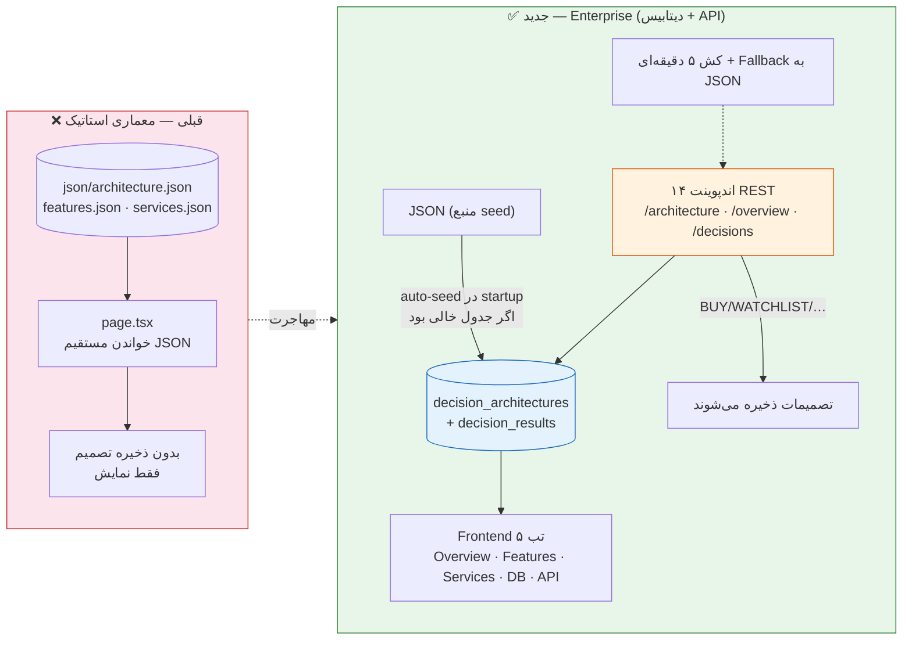
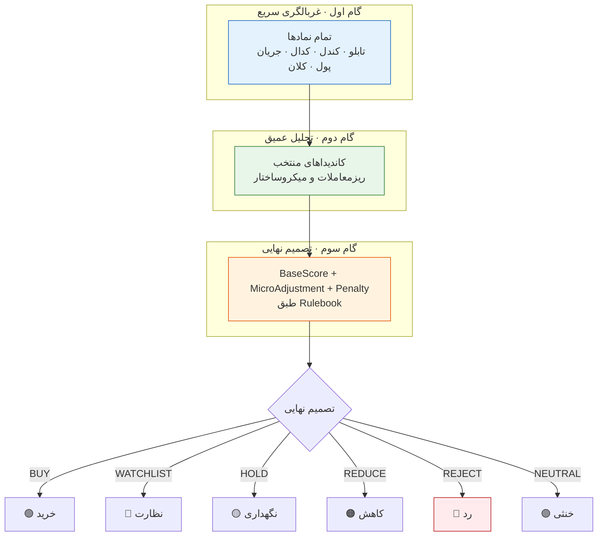

# 🏛️ Decision Engine — سامانه تصمیم‌یار بورس تهران

> **Enterprise Decision Support System** — غربالگری چندمرحله‌ای، تحلیل ۱۱۰ ویژگی، و تصمیم‌گیری هوشمند برای نمادهای بورس تهران.

این سند مستندات کامل مسیر `/decision-engine` (frontend) و APIهای پشتیبان آن (backend) را شامل می‌شود: ۱۴ اندپوینت REST، ۵ تب داشبورد، مدل‌های دیتابیس، معماری ۱۲ لایه، ۱۱۰ ویژگی، و ۲۲ سرویس.

---

## 📋 فهرست مطالب

- [معماری کلی](#معماری-کلی)
- [Frontend Route (/decision-engine)](#frontend-route-decision-engine)
- [Backend API](#backend-api)
- [مدل‌های داده](#مدل‌های-داده)
- [JSON Data Files](#json-data-files)
- [نحوه استفاده](#نحوه-استفاده)
- [Docker](#docker)
- [Development](#development)

---

## معماری کلی

سامانه تصمیم‌یار یک **سیستم تصمیم‌یار چندلایه** است که با معماری ۱۲ لایه و ۲۲ سرویس طراحی شده است.

### اصول معماری

| کد | اصل | توضیح |
|----|-----|-------|
| SCL | Scalability | مقیاس‌پذیری افقی و عمودی |
| EXP | Explainability | توضیح‌پذیری هر تصمیم |
| REP | Reproducibility | بازتولیدپذیری کامل با همان داده و نسخه |
| VER | Versionability | نسخه‌گذاری مدل، ویژگی‌ها و قواعد |
| AUD | Auditability | ثبت کامل ممیزی |
| OPR | Operational Resilience | تاب‌آوری عملیاتی |

### خط لوله ۳ گامه تصمیم

```
گام اول:  ──>  غربالگری سریع همه نمادها با داده‌های تابلو، کندل، کدال، جریان پول و کلان
                    │
                    ▼
گام دوم:  ──>  تحلیل عمیق ریزمعاملات فقط برای کاندیداهای منتخب
                    │
                    ▼
گام سوم:  ──>  ترکیب BaseScore + MicroAdjustment + Penalty با Rulebook
                    │
                    ▼
           ──>  تصمیم نهایی: BUY / WATCHLIST / HOLD / REDUCE / REJECT / NEUTRAL
```

**مقایسه وضعیت قبلی ← جدید:**



> **قبلی**: داده‌های معماری صرفاً فایل‌های JSON استاتیک بودند و تصمیمات ذخیره نمی‌شد.
> **جدید**: سامانه ۱۲ لایه روی دیتابیس (auto-seed)، ۱۴ اندپوینت REST، ۱۱۰ ویژگی در
> ۸ بلوک و ذخیرهٔ تصمیمات در `decision_results` — با کش و Fallback برای تاب‌آوری.


---

## Frontend Route

**دیاگرام خط لوله ۳ گامه تصمیم:**




 (/decision-engine)

مسیر `/decision-engine` یک داشبورد کامل با ۵ تب اصلی است.

### تب Overview

| بخش | توضیح |
|-----|-------|
| **System Header** | نام سامانه، نسخه، اصول معماری، منابع داده |
| **۱۲ لایه معماری** | آکاردئون تعاملی لایه‌ها با توضیحات، مسئولیت‌ها و سرویس‌ها |
| **رادار ۸ سوبرسکور** | نمودار راداری با PolarGrid نمایش S_F تا S_E |
| **نوار امتیاز** | نمایش درصدی هر سوبرسکور با BaseScore وزنی |
| **تصمیمات خرید (لایو)** | دریافت از API و نمایش در جدول/کارت + دکمه افزودن به لیست پیگیری |
| **خط لوله ۳ گامه** | کارت‌های گرافیکی سه مرحله غربالگری |

### تب Features (۱۱۰ ویژگی)

| بلوک | تعداد | توضیح |
|------|-------|-------|
| A (کیفیت داده) | ۱۰ | completeness, freshness, accuracy |
| B (بنیادی) | ۱۵ | EPS, P/E, capital, assets |
| C (ارزش‌گذاری) | ۱۰ | P/E نسبی، بازده سود، نرخ دلار |
| D (تکنیکال) | ۱۵ | RSI, MACD, ATR, SMA, volume spike |
| E (جریان پول) | ۱۰ | خرید/فروش حقوقی، حقیقی |
| F (ریزساختار) | ۱۰ | VWAP, بلوک، کدبه‌کد |
| G (رویدادی) | ۲۰ | مجمع، افزایش سرمایه، تنش سیاسی |
| H (امتیاز نهایی) | ۲۰ | ۸ سوبرسکور، Penalty، تصمیم |

### تب Services (۲۲ سرویس)

- **Collectors** (۵): دریافت داده از تابلو، کندل، ریزمعاملات، کدال، کلان
- **Processors** (۱۱): استانداردسازی، کیفیت، ویژگی، امتیازدهی، صف، تحلیل، ریسک، تصمیم، گزارش، ممیزی، بک‌تست
- **Management** (۶): API Gateway, Auth, Admin, Dashboard, Scheduler, Alerting

### تب Database

جداول در ۷ گروه: مرجع (۷), خام (۵), کیفیت (۲), ویژگی (۲), امتیاز (۴), تصمیم و ممیزی (۴), عملیاتی (۳)

### تب API

لیست کامل APIهای داخلی (۱۶) و بیرونی (۱۵) با متد، مسیر و توضیحات

---

## Backend API

مسیر پایه: `/api/v1/decision-engine`

### 📊 معماری (Architecture)

| Method | Path | توضیح |
|--------|------|-------|
| `GET` | `/architecture` | دریافت معماری ۱۲ لایه از دیتابیس (JSON fallback) |
| `GET` | `/features` | دریافت ۱۱۰ ویژگی در ۸ بلوک |
| `GET` | `/services` | دریافت ۲۲ سرویس |
| `GET` | `/database` | دریافت ساختار جداول دیتابیس |
| `GET` | `/api` | دریافت لیست API endpoints |
| `GET` | `/overview` | همه داده‌ها یکجا برای داشبورد |
| `POST` | `/seed` | بارگذاری JSON به دیتابیس |

**نمونه درخواست:**

```bash
# دریافت معماری
curl http://localhost:8000/api/v1/decision-engine/architecture

# دریافت نمای کلی
curl http://localhost:8000/api/v1/decision-engine/overview

# بارگذاری داده‌ها در دیتابیس
curl -X POST http://localhost:8000/api/v1/decision-engine/seed
```

### 📋 تصمیمات (Decisions)

| Method | Path | توضیح |
|--------|------|-------|
| `POST` | `/decisions` | ذخیره تصمیم جدید |
| `GET` | `/decisions` | لیست تصمیمات با فیلتر |
| `GET` | `/decisions/buy-candidates` | آخرین BUY هر نماد |
| `GET` | `/decisions/watchlist` | آخرین WATCHLIST هر نماد |
| `GET` | `/decisions/rejected` | آخرین REJECT هر نماد |
| `GET` | `/decisions/{symbol}` | آخرین تصمیم یک نماد |
| `GET` | `/decisions/{symbol}/history` | تاریخچه تصمیمات یک نماد |

**نمونه درخواست:**

```bash
# ذخیره تصمیم جدید
curl -X POST http://localhost:8000/api/v1/decision-engine/decisions \
  -H "Content-Type: application/json" \
  -d '{
    "symbol": "فولاد",
    "run_id": "run-2026-07-27-01",
    "decision": "BUY",
    "final_score": 78.5,
    "confidence": 0.85,
    "score_fundamental": 82,
    "score_technical": 71,
    "score_orderflow": 88,
    "base_score": 76.8,
    "penalty": 0.12,
    "details": {
      "reasons": ["نقدشوندگی بالا", "جریان پول مثبت"],
      "reason_codes": ["LIQ-01", "FLOW-03"]
    }
  }'

# دریافت کاندیداهای خرید
curl http://localhost:8000/api/v1/decision-engine/decisions/buy-candidates?limit=10

# آخرین تصمیم یک نماد
curl http://localhost:8000/api/v1/decision-engine/decisions/فولاد

# تاریخچه
curl http://localhost:8000/api/v1/decision-engine/decisions/فولاد/history?limit=20
```

**Schema درخواست (POST /decisions):**

```json
{
  "symbol": "فولاد",
  "run_id": "run-2026-07-27-01",
  "model_version": "Enterprise-Final-1.0",
  "rulebook_version": "RB-1.0",
  "score_fundamental": 82.5,
  "score_valuation": 65.0,
  "score_technical": 71.0,
  "score_liquidity": 70.0,
  "score_orderflow": 88.3,
  "score_micro": 60.0,
  "score_macro": 45.0,
  "score_event": 50.0,
  "base_score": 76.8,
  "micro_adjustment": 5.0,
  "penalty": 0.12,
  "final_score": 78.5,
  "decision": "BUY",
  "confidence": 0.85,
  "neg_events_count": 1,
  "details": { "reasons": [], "reason_codes": [] }
}
```

**Schema پاسخ:**

```json
{
  "success": true,
  "data": {
    "id": 1,
    "symbol": "فولاد",
    "run_id": "run-2026-07-27-01",
    "decision": "BUY",
    "final_score": 78.5,
    "confidence": 0.85,
    "score_fundamental": 82.5,
    "score_valuation": 65.0,
    "score_technical": 71.0,
    "score_liquidity": 70.0,
    "score_orderflow": 88.3,
    "score_micro": 60.0,
    "score_macro": 45.0,
    "score_event": 50.0,
    "base_score": 76.8,
    "micro_adjustment": 5.0,
    "penalty": 0.12,
    "confidence": 0.85,
    "neg_events_count": 1,
    "details": { "reasons": [], "reason_codes": [] },
    "evaluated_at": "2026-07-27T12:00:00"
  },
  "message": "تصمیم BUY برای فولاد ذخیره شد"
}
```

---

## مدل‌های داده

### جدول: `decision_architectures`

| ستون | نوع | توضیح |
|------|-----|-------|
| `id` | Integer PK | auto-increment |
| `version` | String(50) | unique, indexed |
| `title` | String(200) | عنوان نسخه |
| `data` | JSONB | کل معماری |
| `is_active` | Boolean | پیش‌فرض true |
| `created_at` | DateTime | server_default now |
| `updated_at` | DateTime | nullable |

### جدول: `decision_results`

| ستون | نوع | توضیح |
|------|-----|-------|
| `id` | Integer PK | auto-increment |
| `symbol` | String(20) | indexed |
| `run_id` | String(50) | indexed |
| `model_version` | String(50) | نسخه مدل |
| `rulebook_version` | String(50) | نسخه Rulebook |
| `score_*` (8 ستون) | Float | سوبرسکورها (0-100) |
| `base_score` | Float | مجموع وزنی |
| `micro_adjustment` | Float | اصلاح ریزساختار |
| `penalty` | Float | جریمه (0-0.35) |
| `final_score` | Float | امتیاز نهایی (0-100) |
| `decision` | String(20) | BUY/WATCHLIST/HOLD/REDUCE/REJECT/NEUTRAL |
| `confidence` | Float | اطمینان (0-1) |
| `neg_events_count` | Integer | رویدادهای منفی |
| `details` | JSONB | nullable |
| `evaluated_at` | DateTime | server_default now |

**ایندکس‌ها:**
- `ix_decision_results_symbol_decision` (symbol, decision)
- `ix_decision_results_decision_final_score` (decision, final_score)
- `ix_decision_results_evaluated_at` (evaluated_at)

---

## JSON Data Files

فایل‌های JSON در دو مسیر قرار دارند:

| مسیر | توضیح |
|------|-------|
| `json/` | داده‌های اصلی (معماری، ویژگی‌ها، سرویس‌ها، دیتابیس، API) |
| `frontend/public/json/` | کپی برای سرو‌دهی استاتیک Next.js |

### فایل‌ها

| فایل | محتوا | حجم تقریبی |
|------|-------|-------------|
| `architecture.json` | سامانه، اصول، ۱۲ لایه، منابع داده، خروجی‌ها | ~۱۵KB |
| `features.json` | ۱۱۰ ویژگی در ۸ بلوک با توضیحات فارسی | ~۳۰KB |
| `services.json` | ۲۲ سرویس با دسته‌بندی و وابستگی‌ها | ~۸KB |
| `database.json` | ۳۰+ جدول در ۷ گروه | ~۱۰KB |
| `api.json` | ۳۱ اندپوینت (۱۶ داخلی + ۱۵ بیرونی) | ~۶KB |

---

## نحوه استفاده

### ۱. دسترسی به صفحه وب

```
http://localhost:3000/decision-engine
```

صفحه شامل ۵ تب است:
1. **Overview** — داشبورد اصلی با معماری، امتیازها و تصمیمات زنده
2. **Features** — مرور ۱۱۰ ویژگی
3. **Services** — ۲۲ سرویس با جزئیات
4. **Database** — ساختار جداول
5. **API** — لیست کامل APIها

### ۲. کار با API

```python
import httpx
import asyncio

BASE_URL = "http://localhost:8000/api/v1/decision-engine"

async def main():
    async with httpx.AsyncClient() as client:
        # 1. Seed architecture data into DB
        await client.post(f"{BASE_URL}/seed")

        # 2. Get overview
        r = await client.get(f"{BASE_URL}/overview")
        print(r.json()["data"]["system"]["name"])

        # 3. Save a decision
        r = await client.post(f"{BASE_URL}/decisions", json={
            "symbol": "فولاد",
            "run_id": "test-1",
            "decision": "BUY",
            "final_score": 81.5,
            "confidence": 0.78,
        })
        print(r.json()["message"])

        # 4. Get buy candidates
        r = await client.get(f"{BASE_URL}/decisions/buy-candidates?limit=5")
        for item in r.json()["data"]["items"]:
            print(f"{item['symbol']}: {item['final_score']} — {item['decision']}")

asyncio.run(main())
```

### ۳. اجرای Migration

```bash
alembic upgrade 0013
```

### ۴. بارگذاری داده‌های معماری

```bash
curl -X POST http://localhost:8000/api/v1/decision-engine/seed
```

---

## Docker

### Dockerfile

```bash
# Build
docker build -t decision-engine -f Dockerfile.decision-engine .

# Run
docker run -p 8002:8002 --env-file .env decision-engine
```

### Docker Compose

```yaml
decision-engine:
  build:
    context: .
    dockerfile: Dockerfile.decision-engine
  container_name: tse_decision_engine
  depends_on:
    timescaledb:
      condition: service_healthy
    redis:
      condition: service_started
  ports:
    - "8002:8002"
  restart: always
```

---

## Development

### مسیرهای فایل

| مسیر | توضیح |
|------|-------|
| `apps/api/endpoints/decision_engine.py` | تمام ۱۴ اندپوینت API |
| `apps/decision_engine/app.py` | برنامه FastAPI مستقل |
| `models/decision_engine.py` | مدل‌های DecisionArchitecture و DecisionResult |
| `json/*.json` | داده‌های استاتیک معماری |
| `frontend/src/app/decision-engine/page.tsx` | صفحه React |
| `frontend/src/components/DecisionEngineHeader.tsx` | کامپوننت هدر |
| `migrations/versions/0013_decision_engine_tables.py` | Migration |
| `Dockerfile.decision-engine` | Dockerfile سرویس مستقل |

### نکات توسعه

- **Auto-seed**: در `apps/decision_engine/app.py`، هنگام startup به طور خودکار (در پس‌زمینه) داده‌های JSON را در دیتابیس بارگذاری می‌کند اگر خالی باشد
- **Cache**: داده‌های استاتیک معماری با TTL ۵ دقیقه در حافظه کش می‌شوند
- **Fallback**: اگر دیتابیس در دسترس نباشد، از فایل‌های JSON استفاده می‌کند
- **CORS**: سرویس مستقل از تنظیمات CORE API استفاده می‌کند (`core.config.settings`)

### تست

```bash
# تست API
curl http://localhost:8000/api/v1/decision-engine/architecture | python -m json.tool

# تست سرویس مستقل
curl http://localhost:8002/health
curl http://localhost:8002/decision-engine/architecture

# تست تصمیمات
curl -X POST http://localhost:8000/api/v1/decision-engine/decisions \
  -H "Content-Type: application/json" \
  -d '{"symbol":"فولاد","run_id":"dev","decision":"WATCHLIST","final_score":65}'
```

---

## 📊 خروجی‌های تصمیم

| کد | نام فارسی | رنگ | توضیح |
|----|-----------|------|-------|
| BUY | خرید | 🟢 `#10b981` | سیگنال خرید قوی |
| WATCHLIST | نظارت | 🔵 `#06b6d4` | پتانسیل خرید، نیاز به بررسی بیشتر |
| HOLD | نگهداری | 🟡 `#f59e0b` | نگهداری position فعلی |
| REDUCE | کاهش | 🟠 `#f97316` | کاهش تدریجی position |
| REJECT | رد | 🔴 `#ef4444` | ریسک بالا، عدم خرید |
| NEUTRAL | خنثی | 🟣 `#6366f1` | عدم وجود سیگنال واضح |

---

## 🏗️ معماری ۱۲ لایه

| لایه | نام | مسئولیت اصلی |
|------|-----|-------------|
| ۱ | Ingestion | دریافت داده از منابع مختلف |
| ۲ | Standardization | نرمال‌سازی و کنترل کیفیت |
| ۳ | Storage | ذخیره‌سازی خام و عملیاتی |
| ۴ | Feature Engineering | تولید ۱۱۰ ویژگی |
| ۵ | Base Scoring | امتیازدهی پایه برای کل بازار |
| ۶ | Candidate Queue | صف کاندیداهای تحلیل عمیق |
| ۷ | Microstructure Analysis | تحلیل ریزمعاملات |
| ۸ | Risk Engine | ارزیابی و جریمه ریسک |
| ۹ | Decision Engine | **تصمیم نهایی (همین سرویس)** |
| ۱۰ | Explainability | گزارش و توضیح‌پذیری |
| ۱۱ | Audit & Backtest | ممیزی و بازپخش |
| ۱۲ | Operations | پایش و راهبری |

---

> **سامانه تصمیم‌یار بورس تهران** — Enterprise Edition v1.0
