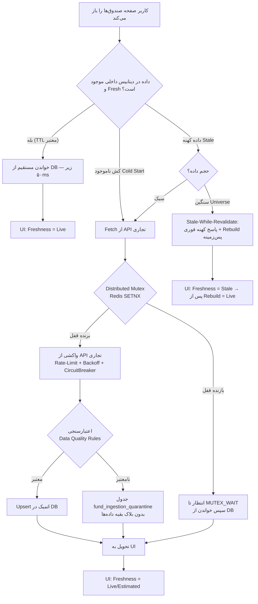

# 🏦 Enterprise Fund Module — معماری Read-Through & ارتقای ماژول صندوق‌ها

> نسخه: v2.0.0 | تاریخ: 2026-09-16 | قواعد: **Additive-Only, Zero Breaking Changes**

## ۱. جریان داده و معماری Read-Through

### دیاگرام باز شدن صفحه صندوق‌ها تا بازگشت داده

### سیاست‌های تازگی داده (TTL Policies)

| نوع داده | TTL | منبع | توضیح |
|---|---|---|---|
| قیمت لحظه‌ای صندوق (`fund_market_quotes_cache`) | ۳۰–۶۰ ثانیه در ساعات بازار (پیش‌فرض ۴۵s)؛ ۱ ساعت خارج بازار | `Tsetmc/Symbol.php` | در `_is_market_open()` کنترل می‌شود (۸:۴۵–۱۲:۳۰ تهران) |
| NAV روزانه (`fund_nav_history`) | تا انتشار NAV بعد از ۱۶:۰۰ | `Tsetmc/Nav.php` | Idempotent روی `(fund_id, nav_date)` — روز تکراری هزینه صفر |
| گزارش ماهانه کدال (`fund_portfolio_reports`, `fund_holdings`) | ۳۰ روز | `Codal/Announcement.php` | دوره منتهی به `period_end_date` |
| Universe کامل | ۶ ساعت | TSE snapshots + `IME/Fund.php` | Stale-While-Revalidate: پاسخ کهنه فوری |
| امتیاز کمی (`fund_scores_history`) | روزانه (idempotent) | محاسبه داخلی | روی تاریخچه NAV داخلی |
| NAV تخمینی (Live Valuation) | همگام با قیمت لحظه‌ای | محاسبه داخلی | Holdings ماه قبل × قیمت لایو |

## ۲. اسکیمای پایگاه داده (Migration 0051 — Additive)

فایل: `migrations/versions/0051_fund_enterprise_module.py` + مدل‌های ORM در `models/fund_enterprise.py`

| جدول | نقش | کلید Idempotency |
|---|---|---|
| `funds` (موجود + ستون‌های nullable جدید: `national_id, manager_name, custodian_name, trading_status, is_etf, discovered_at, last_synced_at`) | اطلاعات پایه | `symbol` (unique موجود) + `isin` index |
| `fund_capabilities` | فلگ‌های `has_nav, has_portfolio, is_etf, has_market_quotes` | `uq_fund_capabilities_fund (fund_id)` |
| `fund_nav_history` | NAV صدور/ابطال/آماری + ارزش دارایی | `uq_fund_nav (fund_id, nav_date)` |
| `fund_portfolio_reports` | سربرگ گزارش ماهانه کدال | `uq_fund_report_period (fund_id, period_end_date)` |
| `fund_holdings` | ریز دارایی (سهام/اوراق/سپرده/طلا/مشتقه) | `uq_fund_holding (fund_id, period_end_date, holding_type, instrument_symbol)` |
| `fund_portfolio_diffs` | ورود/خروج پول بین دو دوره | `uq_fund_diff (fund_id, current_period_date, instrument_symbol)` |
| `fund_market_quotes_cache` | کش قیمت لحظه‌ای + صف خرید/فروش | `uq_fund_quote (fund_id)` |
| `fund_scores_history` | امتیاز و رتبه دوره‌ای | `uq_fund_score (fund_id, score_date)` |
| `fund_ingestion_quarantine` | داده مخرب برای ممیزی | `record_fingerprint` |
| `fund_meta` | Snapshot universe (ساخته‌شده خودکار) | `meta_key` |

**کلید کانونی:** اولاً `isin`، ثانیاً `national_id` — تغییر نماد/تفکیک/توقف مشکلی ایجاد نمی‌کند. `fund_id` منطقی فرمت `tse:نماد` یا `ime:نماد` دارد.

## ۳. لایه کلاینت و Anti-Corruption Adapter

- **کلاینت فیزیکی:** `brsapi/client.py` موجود — Token-Bucket Rate Limiter، Exponential Backoff با Jitter (429/5xx)، Circuit Breaker، Budget Governor پایدار (Redis/فایل)، لاگ بدون API Key. **دوباره‌کاری نشد.**
- **Adapter:** `services/fund_api_adapter.py`
  - نام فیلدهای پرووایدر (`psubtran`, `predtran`, `Buy_I_Volume`, …) هرگز از Adapter خارج نمی‌شود.
  - اعتبارسنجی: NAV مثبت، وزن ۰..۱۰۰، جمع وزن ±۳٪، تاریخ ساخت‌یافته شمسی/میلادی (`parse_jalali`/`parse_gregorian`).
  - قرنطینه با session مستقل — خطای DB جدول قرنطینه هرگز جریان اصلی را نمی‌شکند.

## ۴. سرویس Read-Through (`services/fund_read_through.py`)

| متد | رفتار |
|---|---|
| `get_fund_universe()` | DB → TTL ۶h → Cold: Mutex + ساخت؛ Stale: SWR پس‌زمینه |
| `get_fund_nav_history(fund_id, start, end)` | DB → Gap-Filling از API با Mutex `nav:{fund_id}` |
| `get_fund_holdings(fund_id, period)` | DB → JIT از کدال با Mutex |
| `get_live_valuation(fund_id)` | Holdings ماه قبل × قیمت لایو + Coverage Ratio |

- **Distributed Mutex:** Redis `SET NX EX 120` + اسکریپت Lua برای آزادسازی امن (توکن‌دار)؛ fallback به `asyncio.Lock` پروسه‌ای.
- **Thundering Herd:** بازنده‌های قفل تا ۳۰ ثانیه منتظر می‌مانند و سپس از DB می‌خوانند — فقط یک call به پرووایدر.

## ۵. موتور محاسباتی (`services/fund_quant_engine.py`)

- متریک‌ها: `compute_sharpe`, `compute_sortino`, `compute_max_drawdown`, `compute_calmar`, `compute_alpha_beta`, `compute_tracking_error` — همه با ۲۵۰ روز کاری ایران و بدون Look-Ahead.
- امتیاز: `Score = w1·Return + w2·Risk + w3·Liquidity + w4·Stability` با `ScoreWeights` قابل تنظیم (۰.۳۵/۰.۳۰/۰.۲۰/۰.۱۵).
- بک‌تست: `buy_hold` | `dca_monthly` (اولین روز معاملاتی هر ماه شمسی) | `dip_buying` (افت ≥ آستانه از سقف ۲۰روزهٔ گذشته، حداکثر هر ۵ روز) — کارمزد ۰.۰۰۵۹۵۲ و تقویم ایران (پنجشنبه/جمعه تعطیل).

## ۶. API Contract (نسخه‌بندی‌شده `/funds/v2`)

| Endpoint | خروجی کلیدی |
|---|---|
| `GET /funds/v2/universe?type=&market=&search=` | `{funds[], total, freshness, fetched_from}` |
| `GET /funds/v2/{fund_id}/nav-history?start_date=&end_date=` | `{points[], count, freshness}` |
| `GET /funds/v2/{fund_id}/holdings?period_date=` | `{holdings[], diffs[], freshness}` |
| `GET /funds/v2/{fund_id}/valuation` | `{nav_estimated, nav_official, coverage_pct, freshness}` |
| `GET /funds/v2/{fund_id}/score` | `{total, components{}, metrics{sharpe,…}}` |
| `GET /funds/v2/{fund_id}/backtest?initial_amount=&monthly_amount=` | `{strategies{buy_hold,dca_monthly,dip_buying}}` |
| `GET /funds/v2/rankings?limit=` | `{rankings[]}` |
| `GET /funds/v2/portfolio-diffs?fund_id=&flow=` | `{diffs[]}` |
| `GET /funds/v2/monitoring` | متریک‌های پایش |

`fund_id` = `tse:آگاس` یا `ime:X`؛ نماد خام هم پذیرفته می‌شود. Endpoint‌های فعلی `/funds/*` دست‌نخورده‌اند.

## ۷. فرانت‌اند

- `frontend/src/components/FundAnalyticsPanel.tsx` — ۸ تب: نمای کلی، روند NAV، ترکیب دارایی، گزارش‌های کدال (diffs)، گروه‌بندی صنعتی، رتبه‌بندی، بک‌تست، پیش‌بینی/ML.
- `frontend/src/components/FundDiscoveryBanner.tsx` — نوار وضعیت Discovery/سلامت ماژول در صفحه لیست (غیرمسدودکننده).
- Chips تازگی: `Live` (سبز pulse) / `Estimated` (کهربایی) / `Stale` (قرمز).
- First-time Discovery: Skeleton + progress shimmer؛ هیچ درخواستی بلاک نمی‌شود.
- State Machine هر تب: `loading (Skeleton) → discovering (progress) → data (chip تازگی) → error (retry-able)`.
- اتصال: صفحه جزئیات `/funds/[symbol]` پنل را زیر کارت‌های موجود رندر می‌کند؛ صفحه `/funds` بنر را بالای کارت‌ها می‌گذارد.

## ۸. چک‌لیست اولویت‌بندی و پایش

### P0 — ضروری راه‌اندازی
- [x] Migration additive 0051 + ORM models
- [x] Adapter/ACL + قوانین کیفیت داده + قرنطینه
- [x] Read-Through + TTL + Distributed Mutex
- [x] Endpoint‌های `/funds/v2` با versioning
- [x] Live Valuation با Coverage Ratio
- [x] پنل ۸‌تابه + Discovery Banner (فرانت)
- [x] تست‌های موتور کمی و Adapter (۳۸ تست)

### P1 — پایداری و بار
- [ ] Cron کشف دوره‌ای Universe (هر ۶ ساعت) به‌جای Lazy-only
- [ ] Backfill تاریخچه NAV کامل از `brsapi_nav_records` به `fund_nav_history`
- [ ] `pg_partman`/partitioning روی `fund_nav_history` پس از عبور از ۱۰M ردیف
- [ ] Export متریک‌ها به Prometheus (`fund_universe_count`, `fund_quarantine_total`, `fund_quote_age_seconds`, `fund_provider_latency_ms`)
- [ ] Alert روی `quarantine_unreviewed > 100` و `cache_hit_ratio < 0.8`

### P2 — کمی و پیشرفته
- [ ] پر کردن خودکار `fund_portfolio_diffs` پس از دریافت دو دوره متوالی
- [ ] Grouping صنعتی واقعی با join سکتور نمادها
- [ ] مدل ML پیش‌بینی NAV (تب ۸) روی `fund_nav_history`
- [ ] Backtest با قیمت‌های EF槀تمام (VWAP) و کارمزد افتراقی صدور/ابطال
- [ ] تنظیم وزن‌های امتیاز از UI ادمین

### متریک‌های مانیتورینگ
| متریک | اندازه‌گیری | هدف |
|---|---|---|
| Success Rate پرووایدر | `sync_log` / لاگ Adapter | > ۹۵٪ |
| Cache Hit Ratio | `GET universe` از DB نسبت به کل | > ۸۰٪ |
| Quarantine Count | `fund_ingestion_quarantine WHERE reviewed=FALSE` | نزدیک صفر |
| Provider Latency | لاگ `fetch` کلاینت | p95 < ۲s |
| Quote Freshness | `now() - max(quoted_at)` | < TTL |
