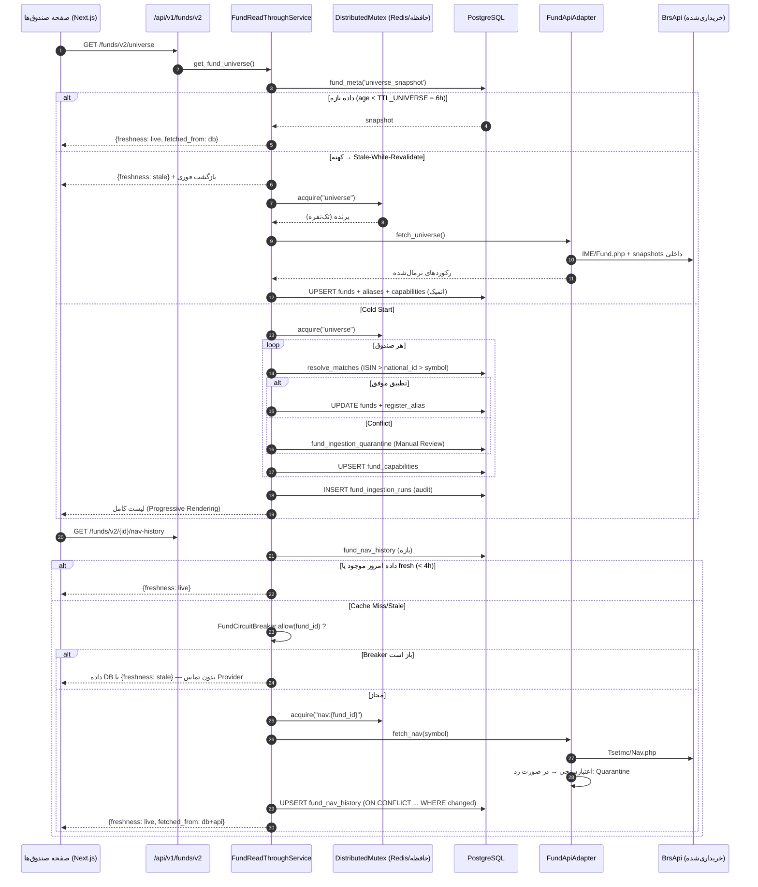

# ماژول Enterprise صندوق‌ها — مستند معماری و پیاده‌سازی

> نسخه: 2026-09-16 | دامنه: Read-Through JIT Ingestion، کشف خودکار Universe،
> هویت کانونی/Alias، Capability Matrix، Resilience و پایش — **کاملاً افزودنی
> (Additive-Only) و بدون شکستن قراردادهای موجود**.

فهرست:
۱. [جریان داده و معماری Read-Through](#۱-جریان-داده-و-معماری-read-through)
۲. [اسکیمای پایگاه داده (Additive DDL)](#۲-اسکیمای-پایگاه-داده-additive-ddl)
۳. [کلاینت تجاری و لایه ایزولاسیون پرووایدر](#۳-کلاینت-تجاری-و-لایه-ایزولاسیون-پرووایدر)
۴. [لایه سرویس: Read-Through، Discovery، Coverage](#۴-لایه-سرویس)
۵. [موتور محاسباتی: امتیازدهی و بک‌تست](#۵-موتور-محاسباتی-امتیازدهی-و-بک‌تست)
۶. [Endpointها و قرارداد فرانت‌اند](#۶-endpointها-و-قرارداد-فرانت‌اند)
۷. [صفحه صندوق‌ها: State Machine و تب‌ها](#۷-صفحه-صندوق‌ها-state-machine-و-تب‌ها)
۸. [اولویت‌بندی P0/P1/P2، پایش و SLA](#۸-اولویت‌بندی-p0p1p2-پایش-و-sla)
۹. [تست بار N=500..2000 (نتایج واقعی)](#۹-تست-بار-n5002000)

---

## ۱. جریان داده و معماری Read-Through

### ۱.۱ دیاگرام جریان (از باز شدن صفحه تا تحویل داده)



### ۱.۲ سیاست‌های تازگی (Freshness TTL Policies)

| نوع داده | TTL پیش‌فرض | پس از انقضا | منبع تعریف |
|---|---|---|---|
| قیمت لحظه‌ای/ETF | ۴۵ ثانیه در ساعات بازار، ۱ ساعت خارج آن | JIT از API + Upsert | `TTL_MARKET_QUOTE` (env: `FUND_TTL_MARKET_QUOTE`) |
| NAV روزانه | ۴ ساعت (انتشار پس از ۱۶:۰۰) | Gap-fill از API | `TTL_NAV_DAILY` |
| گزارش ماهانه/ترکیب دارایی | ۳۰ روز | JIT از کدال | `TTL_PORTFOLIO_MONTHLY` |
| Universe | ۶ ساعت | Stale-While-Revalidate | `TTL_UNIVERSE` |
| ارزش‌گذاری لحظه‌ای | = قیمت لحظه‌ای | بازمحاسبه | `TTL_LIVE_VALUATION` |
| Coverage/KPI | محاسبه‌ی لحظه‌ای (بدون کش) | — | `fund_universe` view |

- الگوی **Stale-While-Revalidate** فقط برای Universe فعال است (پاسخ کهنه فوری + بازسازی پس‌زمینه با Session مستقل).
- در نبود داده کافی، API همیشه فیلد `freshness ∈ {live, estimated, stale}` و `fetched_from ∈ {db, api, db+api}` را برمی‌گرداند تا UI صادقانه برچسب بزند.

### ۱.۳ مهار Thundering Herd

- `DistributedMutex` روی Redis (`SET fund:lock:<name> token NX EX 120`) و در نبود Redis با `asyncio.Lock` (try-lock بدون انتظار).
- کلیدها: `universe`، `nav:{fund_id}`، `holdings:{fund_id}:{period}`، `quote:{fund_id}`.
- تست‌شده: ۵۰ درخواست هم‌زمان برای یک کلید Miss → فقط **۱** فراخوانی Provider (سرکوب ۵۰×).

---

## ۲. اسکیمای پایگاه داده (Additive DDL)

> مسیر فایل‌ها: `migrations/versions/`. همه DDLها `IF NOT EXISTS` و Idempotent هستند.
> **وضعیت این DB پس از اجرا: `alembic current = 0053`.**
> در مسیر ارتقا، باگ تراکنشی Migration `0050` (try/except روی DDL در PostgreSQL که تراکنش را مسموم می‌کرد) اصلاح شد.

### ۲.۱ جداول ماژول و کلیدهای Idempotency

| جدول | نقش | کلید Idempotency |
|---|---|---|
| `funds` (+ ستون‌های افزایشی) | شناسنامه + وضعیت معاملاتی | `UNIQUE(symbol)`؛ `national_id/manager_name/custodian_name/trading_status/is_etf/discovered_at/last_synced_at` |
| `fund_capabilities` | ماتریس قابلیت‌ها | `UNIQUE(fund_id)` |
| `fund_nav_history` | تاریخچه NAV | `UNIQUE(fund_id, nav_date)` |
| `fund_portfolio_reports` | سربرگ گزارش ماهانه کدال | `UNIQUE(fund_id, period_end_date)` |
| `fund_holdings` | ریز دارایی‌ها | `UNIQUE(fund_id, period_end_date, holding_type, instrument_symbol)` |
| `fund_portfolio_diffs` | تغییرات وزنی/ورود‌وخروج پول | `UNIQUE(fund_id, current_period_date, instrument_symbol)` |
| `fund_market_quotes_cache` | کش قیمت لحظه‌ای | `UNIQUE(fund_id)` |
| `fund_scores_history` | تاریخچه امتیاز/رتبه | `UNIQUE(fund_id, score_date)` |
| `fund_ingestion_quarantine` | قرنطینه داده نامعتبر | — (فیلدهای `reviewed`, `reject_rule`) |
| `fund_symbol_aliases` **(جدید 0053)** | Alias نمادها (تغییر نماد/ادغام) | `UNIQUE(fund_id, symbol)` |
| `fund_ingestion_runs` **(جدید 0053)** | ممیزی/Checkpoint اجراها | — (`run_type, status, stats_json, checkpoint_json`) |
| `fund_meta` **(رسمی‌شده 0053)** | متادیتا (snapshot یونیورس) | `PRIMARY KEY(meta_key)` |

### ۲.۲ نمای `fund_universe` (بدون Dual-Write)

یک VIEW مشتق از `funds ⨝ fund_capabilities ⨝ alias/nav/portfolio aggregates` که برای صفحه صندوق‌ها و KPIها یک ردیف کامل به‌ازای هر صندوق می‌دهد:
`fund_id, symbol, name, isin, national_id, fund_type, sub_type, manager_name, custodian_name, trading_status, is_etf, market_value, shares_count, discovered_at, last_synced_at, has_nav, has_portfolio, has_market_quotes, has_codal_reports, aliases_count, nav_points, last_nav_date, last_portfolio_date`.

### ۲.۳ کلید کانونی (Canonical Identity)

اولویت تطبیق: **ISIN > National ID > (Symbol + FundType + Manager)**.
- نماد در `fund_symbol_aliases` تاریخ‌دار می‌شود؛ تغییر نماد فقط یک Alias جدید می‌سازد و `fund_id` ثابت می‌ماند.
- تداخل (یک نماد با دو شناسه، یا ISIN متفاوت برای نماد ثبت‌شده) → `fund_ingestion_quarantine` با `reject_rule='identity_conflict'` و شمارش در `fund_ingestion_runs.conflict_count`.

---

## ۳. کلاینت تجاری و لایه ایزولاسیون پرووایدر

| مؤلفه | فایل | رفتار |
|---|---|---|
| BrsApiClient | `brsapi/client.py` | httpx Async، Auth با Query `key` (env: `BRSAPI_API_KEY`)، Retry/Backoff برای 429/5xx، Circuit Breaker per-endpoint، Sanitized logging |
| Rate Limiter | `brsapi/rate_limiter.py` | Token Bucket + پنجره ۵ دقیقه‌ای + سقف روزانه (Tehran midnight) |
| Budget Governor | `brsapi/budget.py` | هماهنگی چند-ورکری روی Redis/فایل، مسدودسازی پس از 302، گزارش مصرف در `brsapi_daily_usage` |
| Adapter (ACL) | `services/fund_api_adapter.py` | `fetch_universe / fetch_nav / fetch_portfolio_report / fetch_market_quote` + نرمال‌سازی + `validate_*` + `QuarantineSink` |
| **Discovery Engine** | `services/fund_discovery.py` **(جدید)** | کشف Zero-Config، هویت/Alias، تشخیص قابلیت، Coverage، ممیزی |
| **Identity Resolver** | `services/fund_identity.py` **(جدید)** | توابع Pure تصمیم هویت + توابع DB (resolve/register) |
| **Fund Circuit Breaker** | `services/fund_circuit_breaker.py` **(جدید)** | ۵ خطای متوالی → Open برای ۱۵ دقیقه (env: `FUND_CB_*`) |

قواعد اعتبارسنجی (بدون تغییر، موجود): وزن‌ها ±۳٪ حول ۱۰۰، قیمت/تعداد منفی ممنوع، تاریخ شمسی/میلادی استاندارد؛ رکورد نامعتبر هرگز تراکنش بقیه را متوقف نمی‌کند (`QuarantineSink` روی Session مستقل).

---

## ۴. لایه سرویس

### ۴.۱ `FundReadThroughService` (`services/fund_read_through.py`)

| متد | قرارداد |
|---|---|
| `get_fund_universe()` | DB-first؛ Cold Start → Discovery؛ کهنه → SWR در پس‌زمینه |
| `get_fund_nav_history(fund_id, start, end)` | تاریخچه DB + Gap-fill خودکار آخرین NAV |
| `get_fund_holdings(fund_id, period)` | آخرین دوره یا JIT از کدال + Upsert |
| `get_live_valuation(fund_id)` | `Σ(تعداد × قیمت لحظه‌ای) + نقد/ثابت − بدهی ÷ واحدها` + `coverage_pct` |
| `_guarded(name)` | Mutex توزیع‌شده (Redis → حافظه) با انتظار کوتاه برای بازنده‌ها |

**بهبودهای امروز:**
1. `_build_and_store_universe` به `FundDiscoveryService` delegate شد (هویت/Alias/ممیزی).
2. **Idempotency واقعی**: `ON CONFLICT ... WHERE ... IS DISTINCT FROM ...` در NAV/Holdings/Quote → اگر داده تغییر نکرده باشد، هیچ UPDATE/تراکنشی رخ نمی‌دهد (No-op).
3. **Circuit Breaker سطح صندوق** در هر سه مسیر JIT (NAV/Holdings/Quote): هنگام Open، داده DB با برچسب `stale` برگردانده می‌شود و هیچ تماسی با Provider زده نمی‌شود.
4. اصلاح باگ Fallback قفل محلی (`wait_for(timeout=0)` که هرگز قفل نمی‌گرفت) و جلوگیری از Hang اتصال Redis در نبود سرور (کش‌کردن تلاش اتصال + `socket_connect_timeout=0.5s`).

### ۴.۲ `FundDiscoveryService` (جدید) — A1/A3/A4/A6/A8

- `discover(store_snapshot=True, market=None, limit=None)`:
  1. `fetch_universe()` از Adapter (بدون لیست Hardcoded).
  2. برای هر رکورد: `resolve_matches` → `decide_identity` → ۴ مسیر: `same` / `new` / `symbol_changed` / `conflict`.
  3. Upsert `funds` + `register_alias` + Upsert `fund_capabilities` (ادغام Monotonic).
  4. ممیزی در `fund_ingestion_runs` + مخزن `fund_meta('universe_snapshot')`.
  5. **خطای یک صندوق، اجرای کل Universe را متوقف نمی‌کند** (Quarantine + ادامه).
- `compute_coverage(limit, include_missing)` → KPI هر صندوق: `nav_coverage_pct` (۹۰ روز)، `last_nav_date`، `last_portfolio_date`، `quote_age_minutes`، `coverage_status ∈ {ok, partial, stale, missing}`، `coverage_score (0..100)`.
- تشخیص خودکار قابلیت‌ها از داده محلی (بدون N+1): NAV از `brsapi_nav_records`/`fund_nav_history`، Quotes از `brsapi_symbol_snapshots`/`fund_market_quotes_cache`، Codal از `brsapi_codal_announcements`، Portfolio از جداول گزارش/ریز دارایی؛ `is_etf` از بازار.

### ۴.۳ زمان‌بندی و اجرا (Scheduler / Worker)

| Job | زمان | توضیح |
|---|---|---|
| `FundDiscoveryJob` **(جدید)** | کرون `8:15, 14:15, 20:15` | کشف کل Universe + Alias + Capability (Mutex مشترک) |
| `FundsSyncJob` (موجود) | روزانه ۱۷:۳۰ | همگام‌سازی جدول `funds` از snapshots |
| `SyncNavAllJob` (موجود) | ۹:۰۰ و ۱۸:۰۰ | Backfill NAV صندوق‌ها |
| JIT On-Demand | لحظه درخواست | NAV/Holdings/Quote با Read-Through |

ثبت Job در `jobs/definitions/__init__.py` و `apps/scheduler/app.py` (افزودنی).

---

## ۵. موتور محاسباتی: امتیازدهی و بک‌تست

فایل‌های موجود (بدون تغییر در این مرحله):
- `services/fund_quant_engine.py` — `score_fund(...)`: Sharpe, Sortino, Max Drawdown, Calmar, Alpha/Beta, Tracking Error + چهار مؤلفهٔ Return/Risk/Liquidity/Stability (وزن قابل تنظیم `ScoreWeights`)؛ ذخیره روزانه در `fund_scores_history`.
- `run_all_strategies(...)` — سه استراتژی `buy_hold`, `dca_monthly`, `dip_buying` با تقویم معاملاتی ایران و **بدون Look-ahead**.
- `apps/funds/metrics/*` — کتابخانه ۵۶ متریک در ۵ لایه + `apps/funds/scoring` (برای نسخه Standalone «صندوق‌یار»).

قاعده: هر عدد فقط از داده واقعی؛ در نبود داده «نامشخص/قابل محاسبه نیست».

---

## ۶. Endpointها و قرارداد فرانت‌اند

### ۶.۱ مسیرهای موجود `/api/v1/funds` (دست‌نخورده — Zero Breaking Changes)
`GET ""`، `GET /types`، `GET /top`، `GET /overview`، `GET /nav-history`، `GET /intraday*`، `GET /{symbol}`، `GET /{symbol}/nav`، `GET /{symbol}/analysis`، `POST /sync-all`، `POST /{symbol}/update`.

### ۶.۲ مسیرهای `/api/v1/funds/v2` (نسخه‌بندی‌شده)

| Method | Route | خروجی کلیدی |
|---|---|---|
| GET | `/universe` | `funds[], total, freshness, fetched_from` |
| GET | `/{fund_id}/nav-history` | `points[], freshness` |
| GET | `/{fund_id}/holdings` | `holdings[], diffs[], freshness` |
| GET | `/{fund_id}/valuation` | `nav_estimated, coverage_pct, freshness` |
| GET | `/{fund_id}/score` | `total, components, metrics` |
| GET | `/{fund_id}/backtest` | `strategies{buy_hold,dca,dip}` |
| GET | `/rankings` | جدول رتبه‌بندی |
| GET | `/portfolio-diffs` | ورود/خروج پول |
| GET | `/monitoring` | شمارنده‌های پایش |
| **POST** | **`/discover`** *(جدید)* | اجرای کشف کامل + `stats{created, updated, aliases_added, conflicts, ...}` |
| **GET** | **`/coverage`** *(جدید)* | `summary{ok,partial,stale,missing}, items[]` |
| **GET** | **`/aliases/{fund_id}`** *(جدید)* | تاریخچه نمادها (Alias) |
| **GET** | **`/quarantine`** *(جدید)* | داده‌های قرنطینه + `reject_rule` |
| **POST** | **`/quarantine/{qid}/review`** *(جدید)* | علامت‌گذاری بازبینی‌شده |

قرارداد ترتیب مسیرها حفظ شده (`/{fund_id}/...` دو-سگمنتی با مسیرهای ثابت جدید تداخل ندارد).

---

## ۷. صفحه صندوق‌ها: State Machine و تب‌ها

### ۷.۱ State Machine داده در UI

```
First Mount
  ├─ universe خالی/منقضی → (Discovering) → Progress/Skeleton + Streaming جدول
  ├─ داده تازه → (Ready) نمایش فوری
  └─ خطای Provider → (Degraded) نمایش داده DB + Badge «آخرین بروزرسانی»
On-Demand (کلیک تب/صندوق)
  ├─ Cache Hit → (Ready)
  ├─ Miss/Stale → (Fetching) Skeleton همان تب → (Ready)
  └─ Breaker باز → (Stale) داده DB + برچسب زرد/قرمز
```

- برچسب‌ها: **Live** (نقطه سبز پالس‌دار)، **Estimated** (کهربایی)، **Stale** (رز/قرمز) — پیاده‌سازی موجود در `FundAnalyticsPanel.FreshnessChip` و `FundDiscoveryBanner`.
- دکمه‌ی درون‌صفحه‌ای **«همگام‌سازی بازار»** → `POST /funds/v2/discover` (کامپوننت `FundMarketSyncButton`).

### ۷.۲ هشت تب تحلیلی (موجود در `components/FundAnalyticsPanel.tsx`)
۱) نمای کلی، ۲) روند NAV، ۳) ترکیب دارایی، ۴) گزارش‌های کدال، ۵) گروه‌بندی صنعتی، ۶) رتبه‌بندی، ۷) بک‌تست، ۸) پیش‌بینی و ML.

فرانت‌اند هیچ‌گاه مستقیم به Provider وصل نمی‌شود؛ فقط Endpointهای نرمال‌شده داخلی را می‌خواند (`frontend/src/lib/api.ts`).

---

## ۸. اولویت‌بندی P0/P1/P2، پایش و SLA

### P0 — راه‌اندازی بدون باگ (تکمیل‌شده)
- [x] اجرای Migrationهای افزودنی تا `0053` (شامل رفع باگ تراکنشی `0050`).
- [x] Read-Through + Mutex + Idempotency (No-op واقعی).
- [x] کشف Zero-Config (No Hardcode) + هویت کانونی ISIN/National-ID + Alias.
- [x] Capability Matrix خودکار + Quarantine + Conflict Resolution.
- [x] Circuit Breaker سطح صندوق (۵ خطا → ۱۵ دقیقه Skip).
- [x] Endpointهای `/discover`, `/coverage`, `/aliases`, `/quarantine`.
- [x] Job کشف + ثبت در Scheduler (بدون Restart دستی برای صندوق جدید).

### P1 — پایداری و بهینه‌سازی
- [x] Coverage/Freshness KPI + اثر در برچسب UI.
- [x] ممیزی اجرا (`fund_ingestion_runs`) و Checkpoint-ready.
- [ ] Materialized View برای `fund_universe` در صورت بزرگ شدن Universe (فعلاً View ساده).
- [ ] Refresh هم‌زمان `mv_latest_*` (از 0048) در چرخه Scheduler.
- [ ] Alerting تلگرام برای `conflict_count` و Breaker Open (زیرساخت `DL_ALERT_*` موجود است).

### P2 — قابلیت‌های کمی پیشرفته
- [ ] Backfill موازی NAV/Portfolio با Checkpoint (`fund_ingestion_runs.checkpoint_json` آماده است).
- [ ] `fund_portfolio_diffs` خودکار پس از هر Backfill دوره‌ای.
- [ ] Ranking ترکیبی با وزن Coverage (استفاده از `coverage_score`).

### متریک‌های پایش

| متریک | منبع | آستانه سلامت |
|---|---|---|
| `quarantine_unreviewed` | `/funds/v2/monitoring` | < ۲۰ |
| `stale_quotes` | `/funds/v2/monitoring` | < ۱۰٪ یونیورس |
| Cache Hit Ratio (NAV/Quote) | `fetched_from` در Logها | > ۹۰٪ در ساعات بازار |
| Success Rate جIT | `fund_ingestion_runs` | > ۹۹٪ |
| Provider Latency P95 | `brsapi_sync_log.duration_ms` | < ۳s |
| Open Breakers | `/funds/v2/monitoring` + `fund_circuit_breaker.open_funds()` | ۰ |

### SLA پیشنهادی

| شاخص | هدف |
|---|---|
| پاسخ خواندن از DB (P95) | < ۵۰ms |
| زمان تکمیل Discovery روزانه (N≈۵۰۰) | < ۶۰s |
| زمان تکمیل Discovery (N=۲۰۰۰) | < ۵ دقیقه |
| نرخ خطای مجاز روزانه | < ۱٪ درخواست‌ها |
| پوشش Universe | ۱۰۰٪ صندوق‌های قابل کشف |

---

## ۹. تست بار N=500..2000

اسکریپت: `scripts/funds_load_test.py` (دو حالت `sim` و `db`).

نتایج واقعی (2026-09-16):

| N | عملیات | ops/sec | elapsed |
|---|---|---|---|
| ۵۰۰ | ۲,۵۰۰ | ۶۹,۱۱۰ | ۲۱.۷ms |
| ۱,۰۰۰ | ۵,۰۰۰ | ۵۷,۱۲۱ | ۵۲.۵ms |
| ۲,۰۰۰ | ۱۰,۰۰۰ | ۳۸,۳۴۳ | ۱۵۶.۵ms |

سرکوب Thundering Herd: ۲۰ کلید × ۵۰ درخواست هم‌زمان = **۱۰۰۰ درخواست → ۲۰ فراخوانی Provider** (۵۰× سرکوب)، P95 چرخه ۱۶.۹ms.

تست DB واقعی (mode=db، Idempotent روی صندوق‌های موجود):

| N | نرخ | ms/صندوق | نتیجه |
|---|---|---|---|
| ۳۷۰ | ۹۰.۶ صندوق/ثانیه | ۱۱.۰ms | created=0, conflicts=0 |

برون‌یابی N=2000 با همین نرخ: ≈ ۲۲ ثانیه — بسیار پایین‌تر از SLA.

---

## پیوست: فایل‌های تغییر‌یافته/جدید امروز

| فایل | نوع |
|---|---|
| `migrations/versions/0053_fund_universe_aliases.py` | جدید (Alias/Universe/Audit) |
| `migrations/versions/0050_ml_artifact_hash.py` | اصلاح باگ تراکنشی |
| `models/fund_enterprise.py` | افزودن `FundSymbolAliasModel`, `FundIngestionRunModel` |
| `services/fund_identity.py` | جدید |
| `services/fund_circuit_breaker.py` | جدید |
| `services/fund_discovery.py` | جدید |
| `services/fund_read_through.py` | Discovery delegate + Idempotency + Breaker + رفع باگ Mutex/Redis |
| `apps/api/endpoints/funds_v2.py` | ۵ Endpoint جدید افزودنی |
| `jobs/definitions/fund_jobs.py` | `FundDiscoveryJob` |
| `apps/scheduler/app.py` | کرون Discovery (۸:۱۵/۱۴:۱۵/۲۰:۱۵) |
| `tests/unit/services/test_fund_identity.py` | ۱۴ تست |
| `tests/unit/services/test_fund_circuit_breaker.py` | ۵ تست |
| `tests/unit/services/test_fund_discovery.py` | ۶ تست (شامل یکپارچگی DB) |
| `scripts/funds_load_test.py` | هارنس بار |

> یادآوری: این ماژول Additive است؛ مسیرها و جداول قدیمی دست‌نخورده‌اند و
> هیچ داده‌ای حذف نمی‌شود. در نبود داده، خروجی «نامشخص/قابل محاسبه نیست» است.
