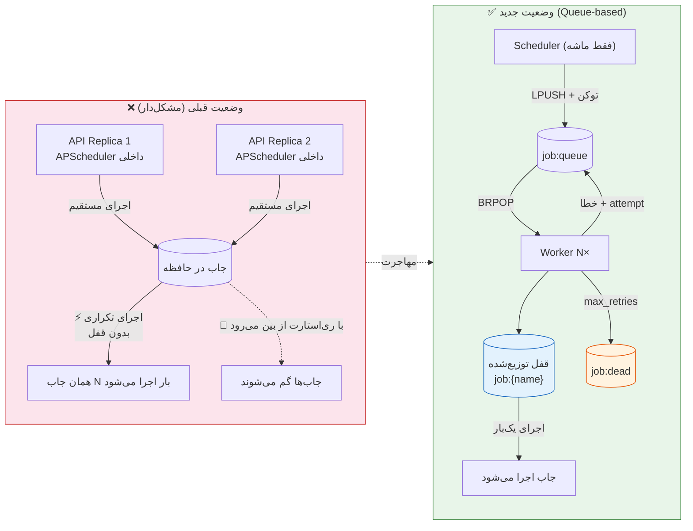
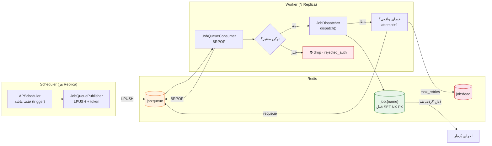

# ⚙️ معماری اجرای توزیع‌شدهٔ جاب‌ها (Distributed Job Queue)

این سند معماری جدید اجرای جاب‌های زمان‌بندی‌شده را شرح می‌دهد: قفل توزیع‌شده با
Redis، انتقال از اجرای مستقیم به Queue-based، احراز هویت Workerها و حالت
Fallback برای محیط توسعه.

---

## ۱. مشکل فعلی

- APScheduler داخل اپلیکیشن FastAPI اجرا می‌شود.
- وقتی چند Replica (Docker Swarm) بالا هستند، **هر replica یک scheduler دارد** و
  جاب‌ها چند بار اجرا می‌شوند.
- **مقایسه وضعیت قبلی ← جدید:**



> **قبلی**: هر Replica زمان‌بند خودش را داشت → اجرای چندباره و از دست رفتن جاب‌ها.
> **جدید**: زمان‌بند فقط ماشه می‌زند، صف + قفل توزیع‌شده اجرای یک‌بار را تضمین می‌کند،
> و در حالت توسعه (`JOB_QUEUE_ENABLED=false`) به همان اجرای in-process برمی‌گردد.


## ۲. معماری جدید

**دیاگرام معماری اجرای توزیع‌شده:**




 (سه لایه)

```
┌──────────────────────────┐        ┌──────────────────────────────┐
│  Scheduler (API replica) │        │  Worker (N replicas)         │
│  APScheduler = فقط ماشه   │        │  JobQueueConsumer            │
│                          │        │                              │
│  trigger → Publisher     │ LPUSH  │  BRPOP job:queue             │
│  JobQueuePublisher ──────┼───────▶│  ├─ verify token (auth)      │
│  (نمی‌داند جاب را اجرا    │        │  ├─ RedisJobLock (قفل توزیع) │
│   کند — فقط push می‌کند)  │        │  └─ job_dispatcher.dispatch  │
└──────────────────────────┘        │     (یک بار اجرا می‌شود)      │
                                    │  خطا → job:retry → job:dead   │
                                    └──────────────────────────────┘
        Redis:  job:queue  (LPUSH/BRPOP — retry هم به همین صف برمی‌گردد)
                job:dead   (dead-letter برای بازبینی دستی)
                job:{name} (قفل توزیع‌شده، SET NX PX)
```

### ۲.۱ قفل توزیع‌شده — `jobs/locking.py`

| متد | رفتار |
|-----|-------|
| `acquire(job_name, ttl=300)` | `SET job:{name} <owner> NX PX <ttl_ms>` — خودکار منقضی می‌شود |
| `release(job_name)` | Lua compare-and-delete — فقط owner می‌تواند آزاد کند |
| `extend(job_name, ttl)` | Lua compare-and-pexpire — تمدید TTL برای جاب‌های طولانی |

دو کلاس:

- **`JobLocking`** (پایه): API سطح پایین `acquire(key, owner, ttl)`. هم Redis و هم
  fallback درون‌حافظه دارد.
- **`RedisJobLock`** (فاساد سازگار با طراحی اولیه): `acquire(job_name, ttl=300)`
  بدون نیاز به owner — توکن owner به‌صورت خودکار ساخته می‌شود.

### ۲.۲ Publisher — `jobs/queue_publisher.py`

```python
from jobs.queue_publisher import JobQueuePublisher

pub = JobQueuePublisher()
await pub.publish("SyncQuotesJob", params={"limit": 100})
# → LPUSH job:queue {job_name, params, job_id, token, published_at}
```

- پیام حاوی **توکن احراز هویت** است (از `JOB_QUEUE_TOKEN`).
- اگر Redis در دسترس نباشد `publish()` مقدار `None` برمی‌گرداند — فراخواننده باید
  به حالت in-process برگردد.

### ۲.۳ Consumer — `jobs/queue_consumer.py`

هر Worker:

1. `BRPOP job:queue` می‌زند.
2. توکن را با `JOB_QUEUE_TOKEN` مقایسه می‌کند (ناهمخوان → drop).
3. از طریق `job_dispatcher.dispatch()` اجرا می‌کند — قفل توزیع‌شدهٔ داخل dispatcher
   تضمین می‌کند جاب **یک بار** اجرا شود (حتی اگر پیام تکراری باشد).
4. اگر قفل گرفته نشود (جاب در جای دیگر در حال اجراست) → skip بی‌خطر.
5. خطای واقعی → پیام با `attempt+1` دوباره روی **همان صف اصلی** گذاشته می‌شود
   (هر worker می‌تواند آن را retry کند)؛ پس از `max_retries` → `job:dead` (dead-letter).

### ۲.۴ Worker — `apps/worker/`

```
python -m apps.worker        # یا docker compose up --scale worker=3
```

`WorkerApp` → `WorkerConsumer` → `JobQueueConsumer`. اگر `JOB_QUEUE_ENABLED=false`
یا Redis در دسترس نباشد، worker بیکار می‌ماند (Fallback در سمت scheduler).

### ۲.۵ Scheduler — `apps/scheduler/app.py`

```python
# حالت queue (چند replica):
#   APScheduler فقط trigger می‌کند → Publisher پیام را در صف می‌گذارد
# حالت in-process (تک‌پردازنده):
#   APScheduler → job_dispatcher.dispatch() — رفتار قبلی
```

برای جاب‌های BrsApi هم `brsapi_registry.run_handler` در حالت queue روی publisher
تنظیم می‌شود.

---

## ۳. احراز هویت Workerها (امنیت صف)

- هر پیام Publisher حاوی `token` است که از `JOB_QUEUE_TOKEN` (متغیر محیطی مشترک)
  خوانده می‌شود.
- Consumer پیام‌هایی با توکن نامعتبر را رد می‌کند (`rejected_auth` شمارنده دارد).
- در Swarm توکن را در Docker Secret یا environment قرار دهید:
  ```yaml
  - JOB_QUEUE_TOKEN=${JOB_QUEUE_TOKEN:?set in production}
  ```
- اگر `JOB_QUEUE_TOKEN` خالی باشد (فقط توسعه) Publisher یک توکن تصادفی
  per-process می‌سازد — برای توسعه کافی است، برای production نه.

---

## ۴. حالت توسعه (Single-Worker بدون Queue) — Fallback Mode 🏠

در محیط توسعه نیازی به Redis Queue نیست:

```bash
# ۱. سوییچ را خاموش بگذارید (پیش‌فرض)
export JOB_QUEUE_ENABLED=false    # یا اصلاً ست نکنید

# ۲. فقط scheduler را اجرا کنید — جاب‌ها in-process اجرا می‌شوند
python -m apps.scheduler
```

رفتار Fallback:

- `SchedulerApp._execute()`: اگر queue غیرفعال باشد یا `publish()` موفق نشود →
  `job_dispatcher.dispatch()` همان‌جا (درون‌همان فرایند) اجرا می‌شود.
- قفل در این حالت درون‌حافظه است (`JobLocking` fallback) — در تک‌پردازنده درست است.
- `docker-compose.yml` برای backend مقدار `JOB_QUEUE_ENABLED=true` دارد — در
  توسعهٔ محلی با `docker compose` همین‌طور خوب است چون worker هم در compose هست.
  برای اجرای محلی بدون داکر، `JOB_QUEUE_ENABLED=false` بگذارید.

### مقایسهٔ حالت‌ها

| حالت | `JOB_QUEUE_ENABLED` | اجرای جاب | مناسب برای |
|------|---------------------|-----------|------------|
| **Dev (تک‌فرایند)** | `false` | in-process (فوری) | توسعه و تست محلی |
| **Docker Compose** | `true` | صف Redis + ۱ worker | تست چندسرویسی |
| **Swarm (تولید)** | `true` | صف Redis + N worker | مقیاس افقی، بدون اجرای دوباره |

---

## ۵. استقرار

### docker-compose

```bash
docker compose up --build -d                # شامل سرویس worker
docker compose up --scale worker=3 -d       # ۳ مصرف‌کننده
docker compose logs -f worker
```

### Swarm

```yaml
# worker را با replicas: 3 deploy کنید؛ backend هم replicas: 2
# (هر replica یک scheduler است ولی قفل + صف جلوی اجرای دوباره را می‌گیرد)
```

نکته: برای اینکه ماشه‌های cron دوبار push نشوند می‌توانید scheduler را فقط در یک
replica نگه دارید (`replicas: 1` برای backend که APScheduler را اجرا می‌کند) —
Workerها می‌توانند هر تعداد باشند.

---

## ۶. مانیتورینگ

```python
from jobs.queue_consumer import get_job_queue_consumer
get_job_queue_consumer().stats()
# → {running, queue, processed, failed, dead_lettered, rejected_auth, uptime_s}

from jobs.queue_publisher import get_job_queue_publisher
await get_job_queue_publisher().queue_size()   # تعداد پیام‌های در صف
```

لاگ‌های کلیدی:

- `Published job SyncQuotesJob to job:queue (<job_id>)`
- `Consuming job SyncQuotesJob (id=... attempt=1)`
- `Job SyncCodalJob requeued (attempt 2) — ...`  ← دوباره به `job:queue` برگشت
- `Job SyncCodalJob dead-lettered after 2 attempts: ...`
- `JobQueueConsumer: rejected message with invalid token (...)`

---

## ۷. فایل‌های مرتبط

| فایل | نقش |
|------|------|
| `jobs/locking.py` | `JobLocking` + `RedisJobLock` — قفل توزیع‌شده (SET NX PX + Lua) |
| `jobs/queue_publisher.py` | ارسال جاب به `job:queue` با توکن |
| `jobs/queue_consumer.py` | مصرف، احراز هویت، قفل، retry → dead-letter |
| `apps/worker/app.py`, `apps/worker/consumer.py`, `apps/worker/__main__.py` | سرویس Worker |
| `apps/scheduler/app.py` | APScheduler → Publisher (یا in-process در fallback) |
| `brsapi/jobs/registry.py` | `run_handler` برای جاب‌های BrsApi در حالت queue |
| `docker-compose.yml` | سرویس `worker` |
| `core/config/__init__.py` | تنظیمات `JOB_QUEUE_*` |
| `tests/unit/jobs/test_locking.py` | تست‌های قفل |
| `tests/unit/jobs/test_queue.py` | تست‌های Publisher/Consumer/RedisJobLock |
