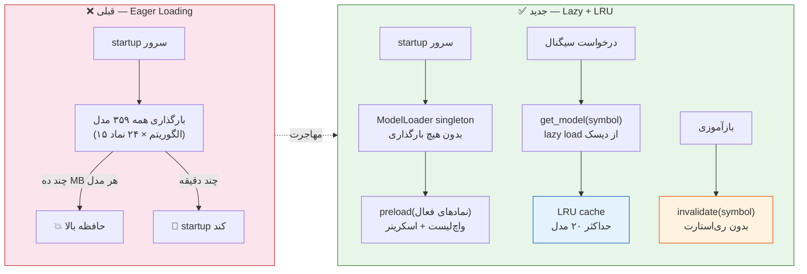
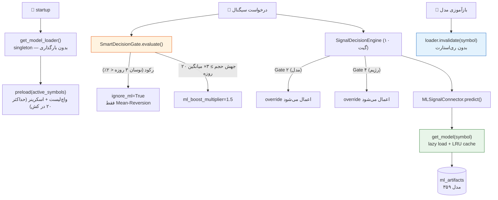

# 🧠 ModelLoader & Smart Decision Gate — راهنمای استفاده

این سند توضیح می‌دهد که چطور سیستم بارگذاری مدل‌های ML (Lazy Loading + LRU Cache)
و گیت‌های هوشمند موتور تصمیم‌گیری کار می‌کنند، و چطور مدل‌های جدید را **بدون
ری‌استارت سرور** وارد کش کنید.

---

## ۱. چرا ModelLoader؟

در `ml_artifacts/` بیش از ۳۵۹ مدل (۱۵ الگوریتم × ~۲۴ نماد) ذخیره شده است.
بارگذاری همهٔ آن‌ها در startup:
- حافظهٔ بسیار بالا مصرف می‌کند (هر مدل scikit-learn / PyTorch چند ده مگابایت است)
- زمان startup را به چند دقیقه افزایش می‌دهد

**مقایسه وضعیت قبلی ← جدید:**



> **قبلی**: همه ۳۵۹ مدل هنگام startup بارگذاری می‌شد → حافظه بالا و startup چند دقیقه‌ای.
> **جدید**: فقط مدل‌های درخواستی lazy-load و حداکثر ۲۰ مدل در LRU کش می‌مانند؛
> پس از بازآموزی، `invalidate()` بدون ری‌استارت نسخه جدید را جایگزین می‌کند.


`ml/model_loader.py` فقط مدل‌هایی را که واقعاً درخواست می‌شوند بارگذاری می‌کند و
حداکثر **۲۰ مدل** را در یک LRU cache نگه می‌دارد.

```python
from ml.model_loader import get_model_loader

loader = get_model_loader()                     # singleton، maxsize=20

model = await loader.get_model(symbol="فولاد")  # lazy load + cache
model = await loader.get_model(symbol="فولاد", algorithm="xgboost")
```

### ساختار دایرکتوری آرتیفکت‌ها

```
ml_artifacts/
├── xgboost_فولاد/
│   ├── model.pkl            # فرمت قدیمی
│   └── metadata.json
├── random_forest_خودرو/
│   └── model_pipeline.pkl   # فرمت جدید (ترجیح داده می‌شود)
└── ...
```

هر دایرکتوری با الگوی `{algorithm}_{symbol}` نام‌گذاری شده است. اولویت
الگوریتم‌ها در `_ALGORITHM_PREFIXES` داخل `ml/model_loader.py` تعریف شده است.

---

## ۲. بارگذاری فقط نمادهای فعال (Watchlist / Smart Screener)

به‌جای بارگذاری همهٔ ۳۵۹ مدل، فقط مدل نمادهایی را که اکنون فعال هستند
(واچ‌لیست کاربر + خروجی smart screener) پیش‌بارگذاری کنید:

```python
from ml.model_loader import get_model_loader

async def warm_up_active_models(active_symbols: list[str]) -> dict:
    """active_symbols = union(واچ‌لیست, اسکرینر فعال)"""
    loader = get_model_loader()
    report = await loader.preload(symbols=active_symbols)
    # → {"loaded": 18, "missing": ["نماد_بدون_مدل"], "symbols": [...]}
    return report
```

- `preload()` فقط مدل‌هایی که روی دیسک موجودند را بارگذاری می‌کند (بدون exception).
- نمادهای بدون مدل در `missing` گزارش می‌شوند و نادیده گرفته می‌شوند.
- LRU همچنان حداکثر ۲۰ مدل را نگه می‌دارد؛ بقیه در صورت نیاز lazy-load می‌شوند.

### گرفتن نمادهای فعال

واچ‌لیست از `WatchlistService.list_items()` و نمادهای اسکرینر از خروجی
`screener` / `smart-screener` در دسترس هستند — این لیست را به `preload()` بدهید.

---

## ۳. افزودن مدل جدید بدون ری‌استارت ✨

چرخهٔ بازآموزی → انتشار → مصرف، **بدون نیاز به ری‌استارت**:

```python
# ۱) مدل جدید آموزش داده و ذخیره شد (مثلاً xgboost_فولاد/v2)
#     trainer ذخیره را در ArtifactManager انجام می‌دهد (model.pkl + metadata.json)

# ۲) کش قدیمی را بی‌اعتبار کنید — نسخهٔ کهنه بلافاصله خارج می‌شود
from ml.model_loader import get_model_loader

get_model_loader().invalidate(symbol="فولاد")               # همهٔ الگوریتم‌های نماد
get_model_loader().invalidate(symbol="فولاد", algorithm="xgboost")  # فقط xgboost

# ۳) درخواست بعدی، مدل جدید را از دیسک می‌خواند
model = await get_model_loader().get_model(symbol="فولاد", algorithm="xgboost")
```

نکات:
- `invalidate(symbol)` بدون algorithm، همهٔ ورودی‌های کش برای آن نماد را پاک می‌کند.
- پس از بازآموزی دسته‌ای، `loader.clear()` همهٔ کش را خالی می‌کند.
- اگر مدل از طریق `scripts/register_ml_artifacts.py` در دیتابیس ثبت می‌شود،
  فقط فراخوانی `invalidate()` کافی است — کشِ دیسک همان‌جا تازه می‌شود.

### توصیه: هوک خودکار پس از بازآموزی

در پایان `TrainingService` / `jobs/model_training.py` فراخوانی کنید:

```python
from ml.model_loader import get_model_loader
get_model_loader().invalidate(symbol, algorithm)
```

---

## ۴. گیت‌های هوشمند موتور تصمیم (SmartDecisionGate)

`services/decision_gate.py` دو دروازهٔ موتور تصمیم را بر اساس **وضعیت واقعی
بازار** (از دیتابیس) بازنویسی می‌کند:

| شرط بازار | منبع داده | Override |
|-----------|-----------|----------|
| دامنهٔ نوسان ۳ روزه < ۲٪ (رکود) | `brsapi_index_values` | `ignore_ml=True` → فقط سیگنال Mean-Reversion |
| حجم معاملات ≥ ۳× میانگین ۲۰ روزه | `brsapi_symbol_snapshots` + `brsapi_historical_daily` | `ml_boost_multiplier=1.5` (رأی ML +۵۰٪) |
| رژیم بازار (TREND/RANGE/CRISIS/…) | `brsapi_index_values` | دروازهٔ ۴ رژیم دقیق می‌شود |

استفاده در `SignalDecisionEngine` (در `signal_decision_engine.py` از قبل سیم‌کشی شده):

```python
from services.decision_gate import SmartDecisionGate, get_decision_gate

gate = SmartDecisionGate(session=db_session)   # یا get_decision_gate(session)
override = await gate.evaluate(symbol="فولاد", market="stock")

# دروازهٔ ۲ (مدل): if override.ignore_ml → سیگنال rule-only
# دروازهٔ ۴ (رژیم): candidate.volatility_regime = override.volatility_regime
```

- وضعیت بازار برای ۵ دقیقه کش می‌شود (`_cached_market_state`) تا بار دیتابیس کم بماند.
- اگر سشن دیتابیس در دسترس نباشد، gate بدون خطا به حالت خنثی برمی‌گردد.

---

## ۵. دیباگ و مانیتورینگ

```python
loader.cache_info()
# → {"maxsize": 20, "currsize": 3, "hits": 42, "misses": 5, "cached_symbols": [...]}

loader.list_cached_symbols()   # نمادهایی که همین حالا در کش هستند
loader.clear()                 # تخلیهٔ کامل کش
```

لاگ‌ها:
- `ModelLoader.preload: N loaded, M missing of K symbols`
- `Invalidated model cache for فولاد (all)`
- `DecisionGate(فولاد/stock): ignore_ml=False ml_boost=1.5 ...`

---

## ۶. دیاگرام جریان




```
startup
  └── get_model_loader()          ← singleton، بدون بارگذاری
  └── preload(active_symbols)     ← فقط واچ‌لیست + اسکرینر (≤ ۲۰ در کش)
        │
درخواست سیگنال
  ├── SmartDecisionGate.evaluate()
  │     ├── brsapi_index_values       → رکود؟ → ignore_ml=True
  │     └── brsapi_symbol_snapshots   → جهش حجم؟ → ml_boost=1.5
  ├── SignalDecisionEngine (10 گیت)
  │     ├── Gate 2 (model)   → override اعمال می‌شود
  │     └── Gate 4 (regime)  → override اعمال می‌شود
  └── MLSignalConnector.predict()
        └── get_model(symbol)         ← lazy load + LRU cache
              │
بازآموزی
  └── loader.invalidate(symbol)       ← بدون ری‌استارت، نسخهٔ جدید جایگزین می‌شود
```

---

## ۷. فایل‌های مرتبط

| فایل | نقش |
|------|-----|
| `ml/model_loader.py` | ModelLoader + LRU cache + singleton |
| `services/decision_gate.py` | SmartDecisionGate + GateOverride |
| `services/signal_decision_engine.py` | موتور ۱۰ دروازه‌ای (گیت ۲ و ۴ با override) |
| `services/ml_signal_connector.py` | اتصال مدل‌ها به پایپ‌لاین سیگنال (مصرف‌کنندهٔ ModelLoader) |
| `tests/unit/test_model_loader.py` | تست‌های ModelLoader (mocked filesystem) |
| `tests/unit/test_decision_gate.py` | تست‌های SmartDecisionGate (fake DB session) |
