# ارزیابی معماری کوانت: چقدر به هدف «بهترین سیگنال برای بازارها» نزدیک شده‌ایم؟

> **سند:** ارزیابی از دید یک معمار سیستم‌های کوانت (Quant System Architect)
> **تاریخ:** ۱۴۰۴/۰۵/۲۲ (12 August 2026)
> **مبنای ارزیابی:** کد واقعی پروژه + آمار واقعی دیتابیس (نه حدس و گمان)

---

## ۰. خلاصه اجرایی (Executive Summary)

**هدف پروژه:** پیدا کردن «بهترین سیگنال‌ها» برای بازارهای ایران — سیگنال‌هایی با دقت قابل اتکا (>۷۰٪ طبق تعریف `QuantSignalOrchestrator`) و انتظار مثبت (Positive Expectancy) پس از کسر هزینه‌ها.

**حکم معمار (Verdict):**

| بُعد | وضعیت | نمره |
|---|---|---|
| 🏗️ **زیرساخت پایپ‌لاین سیگنال** | کامل و حرفه‌ای (۷ مرحله + ۱۰ دروازه + کالیبراسیون + حلقه بازخورد) | ۸/۱۰ |
| 🧠 **لایه ML و مدل‌ها** | کامل (۳۵۹ مدل، لودر LRU، رژیم‌یاب، ensembling) | ۸/۱۰ |
| 🧪 **اعتبارسنجی و بک‌تست** | کامل (walk-forward، مونت‌کارلو، استرس‌تست، paper trading) | ۷/۱۰ |
| 📊 **نتیجه تجربی (Accuracy واقعی)** | 🔴 **پایین‌تر از هدف** — دقت کلی ۳۶.۷٪ (هدف >۷۰٪) | ۲/۱۰ |
| 💰 **نتیجه مالی (Paper Trading)** | 🔴 **بازده منفی** — از ۱ میلیارد به ۸۴۷ میلیون (−۱۵.۲٪) | ۱/۱۰ |
| 🔁 **حلقه بازخورد (Feedback Loop)** | فعال — وزن‌دهی دینامیک بر اساس دقت گذشته | ۶/۱۰ |

> **جمع‌بندی: زیرساختِ «پیدا کردن بهترین سیگنال» ~۸۰٪ ساخته شده، اما خودِ «بهترین سیگنال» هنوز پیدا نشده است.** در زبان یک معمار کوانت: **موتور درست طراحی شده، اما لبه‌ی آماری (Statistical Edge) هنوز اثبات نشده — و شواهد فعلی، در مجموع، منفی است.**

---

## ۱. تعریف هدف و معیارهای سنجش

هدف «پیدا کردن بهترین سیگنال‌ها» را باید به معیارهای قابل اندازه‌گیری تبدیل کرد تا بتوان «فاصله» را سنجید:

| # | معیار | مقدار هدف (طبق طراحی) | مقدار فعلی (واقعی) | وضعیت |
|---|---|---|---|---|
| ۱ | دقت جهت سیگنال (Direction Accuracy) | >۷۰٪ | **۳۶.۷٪** (۳,۶۹۵ سیگنال) | 🔴 خیلی دور |
| ۲ | میانگین بازده هر سیگنال | مثبت | **−۴.۰٪** | 🔴 منفی |
| ۳ | Win Rate در Paper Trading | >۵۰٪ | **۲۸.۴٪** (۸۶۰ برد از ۳,۰۲۸) | 🔴 منفی |
| ۴ | بازده کل Paper Trading | مثبت | **−۱۵.۲٪** (از ۱B → ۸۴۷M) | 🔴 منفی |
| ۵ | نسبت شارپ (بک‌تست‌ها) | >۱ | متغیر — نیاز به ممیزی | ⚠️ نامشخص |
| ۶ | کالیبراسیون احتمال (ECE) | خطای کالیبراسیون کم | فعال اما اعتبارش وابسته به داده ورودی | ⚠️ |

**نتیجه:** با معیارهای صریح، فاصله تا هدف در بُعد «نتیجه» حدود **۲۰٪ پیموده شده** — یعنی ما هنوز در نیمه‌ی اول مسیر اثبات edge هستیم، نه نزدیک هدف.

---

## ۲. چه چیزی ساخته شده؟ (نگاشت به هدف)

### ۲.۱ پایپلاین ۷ مرحلهای سیگنال — `services/quant_signal_orchestrator.py`

**دیاگرام پایپلاین ۷ مرحلهای سیگنال (با حلقه بازخورد):**

```mermaid
flowchart LR
    S1["۱ · MultiMarketSignalEngine<br/>۷ بازار"] --> S2["۲ · SignalFeaturePipeline"]
    S2 --> S3["۳ · MLSignalConnector<br/>+ ۳۵۹ مدل"]
    S3 --> S4["۴ · SignalVotingSystem"]
    S4 --> S5["۵ · ConfidenceScorer"]
    S5 --> S6["۶ · ProbabilityCalibrator"]
    S6 --> S7["۷ · SignalDecisionEngine<br/>۱۰ دروازه + Override"]
    S7 --> OUT["📤 سیگنال نهایی"]
    OUT --> FB["🔁 حلقه بازخورد<br/>signal_accuracy_tracker + performance_tracker"]
    FB -.->|"وزن جدید منابع (بر اساس دقت واقعی)"| S4

    style S7 fill:#fff3e0,stroke:#e65100
    style FB fill:#fce4ec,stroke:#c62828
    style OUT fill:#e8f5e9,stroke:#2e7d32
```




| مرحله | مؤلفه | نقش در هدف |
|---|---|---|
| ۱ | `MultiMarketSignalEngine` | تولید سیگنال خام در ۷ بازار (سهام، طلا، ارز، کریپتو، آپشن، کامودیتی، IME) |
| ۲ | `SignalFeaturePipeline` | ساخت feature vector برای ML |
| ۳ | `MLSignalConnector` + ۳۵۹ مدل | پیش‌بینی جهت با ML (با fallback هیوریستیک) |
| ۴ | `SignalVotingSystem` | رأی‌گیری ترکیبی (قاعده‌محور + ML + Smart Money) |
| ۵ | `ConfidenceScorer` | امتیاز اطمینان کالیبره‌شده (low/medium/high/very_high) |
| ۶ | `ProbabilityCalibrator` | تبدیل امتیاز خام به احتمال برد واقعی (bucket/platt/isotonic) |
| ۷ | `SignalDecisionEngine` | ۱۰ دروازه تصمیم + Rule-Based Override |

### ۲.۲ ۱۰ دروازه تصمیم — `services/signal_decision_engine.py`

ترتیب اجرا: **کیفیت داده ← سلامت مدل ← احتمال کالیبره‌شده ← رژیم بازار ← اجماع ensemble ← نقدشوندگی ← نسبت ریسک/پاداش ← ارزش مورد انتظار ← محدودیت پرتفوی ← قابلیت اجرا.**

این ساختار، درست‌ترین معماری ممکن برای بازار ایران است — مخصوصاً دروازه‌های ۴ (رژیم) و ۲ (سلامت مدل) که با `SmartDecisionGate` و `GateOverride` به قوانین شرطی مجهز شده‌اند:
- رکود بازار (نوسان ۳ روزه < ۲٪) → نادیده‌گرفتن ML و اکتفا به Mean-Reversion
- جهش حجم (۳ برابر میانگین ۲۰ روزه) → وزن رأی ML +۵۰٪

### ۲.۳ حلقه بازخورد (Feedback Loop) — `signal_accuracy_tracker.py` + `signal_performance_tracker.py`

- هر سیگنال در جدول `signal_accuracy` ثبت می‌شود (۲۶ ستون: نماد، بازار، منبع، جهت، بازده واقعی، hit_target1/2، stopped_out...)
- به‌صورت دوره‌ای، دقت ۳ روزه و ۱۰ روزه هر منبع محاسبه و **وزن آن منبع در رأی‌گیری آینده به‌روزرسانی می‌شود** (`_update_accuracy_summary`)
- `EnsembleOptimizer` ترکیب بهینه مدل‌ها را برای هر بازار از روی همین دقت تاریخی انتخاب می‌کند

> این حلقه، شرط لازم برای «یادگیری از اشتباه» است — ولی همان‌طور که در بخش ۴ نشان داده می‌شود، **تا وقتی منابع ضعیف با وزن بالا در رأی‌گیری شرکت کنند، حلقه هم نمی‌تواند خودش را درست کند.**

### ۲.۴ زیرساخت ML — `ml/`

- **۳۵۹ مدل ذخیره‌شده** (`ml_models`) با `ModelLoader` (Lazy Loading + LRU کش ۲۰ تایی) → رفع مشکل حافظه و startup
- `model_registry.py`، `feature_store.py`، `dataset_builder.py`، `evaluation/`، `policies.py`
- `auto_retrain_pipeline.py` — بازآموزی خودکار وقتی دقت افت کند + `loader.invalidate()` برای تازه‌سازی کش

### ۲.۵ اعتبارسنجی — `services/`

- `backtest_framework.py` — ۳ متدولوژی (Vectorized / Event-Driven / Walk-Forward) + مونت‌کارلو + استرس‌تست
- `walk_forward_validator.py` — اعتبارسنجی پنجره‌ای
- `signal_backtest_engine.py` — win rate، profit factor، شارپ، درادان
- **Paper Trading فعال:** ۳,۰۲۸ معامله کاغذی در ۷۳ نماد ثبت شده است (جدول‌های `paper_trades`، `paper_signal_snapshots`، `paper_equity_history`)

---

## ۳. شواهد تجربی — عددهای واقعی (از دیتابیس)

### ۳.۱ دقت کلی سیگنال‌ها (`signal_accuracy`)

```
مجموع سیگنال‌های ارزیابی‌شده: 3,695
درست (direction_correct):     1,357
دقت کل:                       36.73%
میانگین بازده هر سیگنال:      -4.03%
آخرین ارزیابی:                1403-08-10 (روز مسدودی کلید)
```

### ۳.۲ تفکیک بر اساس منبع سیگنال

| منبع | تعداد | درست | دقت | نظر معمار |
|---|---|---|---|---|
| `voting_weighted` (رأی‌گیری وزنی) | ۳,۵۳۰ | ۱,۳۳۲ | **۳۷.۷٪** | 🔴 منبع غالب = منبع ضعیف |
| `commodity_analysis` (کامودیتی) | ۱۱۸ | ۰ | **۰.۰٪** | 🔴 به‌وضوح باگ/برچسب‌گذاری غلط |
| `currency_24h_analysis` | ۲۴ | ۴ | ۱۶.۷٪ | 🔴 ضعیف |
| `snapshot_analysis` | ۱۶ | ۱۵ | ۹۳.۸٪ | 🟡 نمونه بسیار کوچک |
| `smart_money_technical` | ۶ | ۶ | ۱۰۰٪ | 🟡 نمونه بسیار کوچک |
| `options_pcr_analysis` | ۱ | ۰ | ۰٪ | ⚪ غیرقابل اتکا |

### ۳.۳ تفکیک بر اساس بازار

| بازار | تعداد | دقت | تفسیر |
|---|---|---|---|
| stock (سهام) | ۱,۳۷۶ | **۶۲.۹٪** | 🟡 نزدیک‌ترین به هدف ولی هنوز <۷۰٪ |
| ime | ۲۱۰ | ۱۰۰٪ | 🟡 مشکوک — احتمالاً همه «نگه‌داشتن» (کد خودش این را هشدار می‌دهد) |
| crypto | ۵۶ | ۵۳.۶٪ | 🟡 نمونه کوچک |
| gold | ۹۹ | ۴۳.۴٪ | 🔴 پایین‌تر از حد شانس؟ (مرز شانس برای دودویی ~۵۰٪) |
| currency | ۵۰۳ | ۳۶.۰٪ | 🔴 زیر شانس |
| commodity | ۱,۴۴۹ | **۱.۹٪** | 🔴 کاتastroفیک — عملاً تمام دقت کل را نابود کرده |
| option | ۲ | ۰٪ | ⚪ بی‌اهمیت آماری |

### ۳.۴ نتیجه Paper Trading

```
معاملات کاغذی:         3,028  (در 73 نماد)
برد (pnl > 0):           860  → Win Rate = 28.4%
میانگین PnL هر معامله:   -5.03%
مجموع PnL:              -15,237.8 واحد
سرمایه:                 1,000,000,000 → 847,475,349  (−15.2%)
```

---

## ۴. تحلیل ریشه‌ای: چرا با این معماری خوب، نتیجه منفی است؟

### ۴.۱ 🔴 ریشه اول — «منبع غالب، منبع ضعیف است» (تا به‌حال مهم‌ترین کشف)

منبع `voting_weighted` با **۳,۵۳۰ سیگنال از ۳,۶۹۵ (۹۵٪ کل)** منبعی است که رأی‌گیری وزنی تولید می‌کند — و دقتش فقط ۳۷.۷٪ است. یعنی:
- **وزن منابع ضعیف در رأی‌گیری، هنوز بالاست.**
- حلقه بازخورد باید وزن `commodity_analysis` (۰٪ دقت!) را به صفر برساند، اما این منبع هنوز ۱۱۸ سیگنال در دیتاست دارد — نشانه‌ی این که یا وزن‌دهی درست اعمال نمی‌شود، یا منابع ضعیف همچنان به رأی‌گیری راه پیدا می‌کنند.

### ۴.۲ 🔴 ریشه دوم — بازار کامودیتی «آسیب زننده» (۱.۹٪ در ۱,۴۴۹ سیگنال)

دقت ۱.۹٪ روی ۱,۴۴۹ سیگنال از نظر آماری تقریباً غیرممکن است مگر اینکه:
- جهت/برچسب بازده به‌صورت معکوس ثبت شود (برگشتگی علامت)، یا
- سیگنال‌ها روی بازارهایی تولید شوند که پس از تولید، وضعیت‌شان وارونه شده باشد.

این حجم از خطای سیستماتیک، **میانگین کل را به‌سمت پایین می‌کشد** — حذف/اصلاح این بازار به‌تنهایی دقت کل را به ~۵۵٪ می‌رساند.

### ۴.۳ 🟡 ریشه سوم — کالیبراسیون معتبر نیست چون ورودی‌اش معتبر نیست

`ProbabilityCalibrator` بر اساس دقت تاریخی، احتمال برد را کالیبره می‌کند. اگر دقت تاریخیِ ورودی اشتباه باشد (کامودیتی)، احتمال کالیبره‌شده هم اشتباه است — و دروازه‌ی ۳ (Probability Gate) سیگنال‌های اشتباه را با «اطمینان بالا» عبور می‌دهد. **Garbage In, Calibrated Garbage Out.**

### ۴.۴ 🟡 ریشه چهارم — نمونه‌های کوچک با دقت ساختگی

`ime` (۱۰۰٪ در ۲۱۰) و `snapshot_analysis` (۹۳.۸٪ در ۱۶) و `smart_money_technical` (۱۰۰٪ در ۶) — این‌ها یا به‌خاطر «نگه‌داشتن» (hold) هستند (کد خودش هشدار می‌دهد: «IME showing 100% from holds») یا نمونه‌شان آن‌قدر کوچک است که هیچ معنای آماری ندارد. **یک معمار کوانت این‌ها را «دقت» نمی‌نامد — «نویز» می‌نامد.**

### ۴.۵ ⚠️ ریشه پنجم — انجماد داده (رویداد کلید BrsApi)

آخرین داده‌ی زنده‌ی ارزیابی از ۱۴۰۳/۰۸/۱۰ است (کلید مسدود → ۳۰۲ → حالت DB-only). یعنی **۳,۶۹۵ سیگنال ارزیابی‌شده، روی داده‌های قبل از مسدودی است** و بعد از ریست کلید، داده‌های جدید (حدود ۳ روز معاملاتی) باید sync شوند تا ارزیابی ادامه یابد. این عامل مستقیماً دقت را کم نکرده، اما **توانایی سیستم در «یادگیری از شرایط جدید بازار» را متوقف کرده است.**

---

## ۵. کارت امتیاز: فاصله تا هدف (Scorecard)

| قابلیت | ساخته شده؟ | کیفیت | تأثیر بر هدف |
|---|---|---|---|
| تولید سیگنال چندبازاری | ✅ | خوب | لازم اما کافی نیست |
| Feature Engineering | ✅ | خوب | ✅ |
| ML (۳۵۹ مدل + رژیم‌یاب + ensemble) | ✅ | خوب | ✅ |
| کالیبراسیون احتمال | ✅ | متوسط (وابسته به ورودی) | ⚠️ |
| دروازه‌های تصمیم (۱۰ گیت) | ✅ | عالی | ✅ |
| Rule-Based Override (صف/رژیم/حجم) | ✅ | عالی | ✅ |
| حلقه بازخورد دقت → وزن | ✅ | **متوسط — اثرش در داده دیده نمی‌شود** | 🔴 |
| پاک‌سازی منابع/بازارهای ضعیف | ❌ | — | 🔴 |
| اعتبارسنجی walk-forward + paper | ✅ | خوب | ✅ |
| اثبات Edge مثبت | ❌ | **شواهد فعلی منفی است** | 🔴 |

**درصد پیشرفت به سمت هدف (وزن‌دهی):**
- زیرساخت: ~۸۰٪
- نتیجه تجربی (دقت/بازده): ~۲۰٪
- **پیشرفت کل: ~۴۵-۵۰٪** — و نکته مهم این است که بخش زیرساخت **تقریباً تمام شده** و از این‌جا به بعد، پیشرفت فقط از «درست کردن حلقه‌ی یادگیری» می‌آید، نه از ساختن مؤلفه‌ی جدید.

---

## ۶. نقشه راه برای بستن فاصله (اولویت‌بندی شده)

### 🥇 P0 — فوری (تأثیر فوری بر اعداد)
1. **دیباگ بازار کامودیتی** — ۱,۴۴۹ سیگنال با دقت ۱.۹٪ را بررسی کن (احتمالاً معکوس‌شدن علامت). درست‌کردن همین یک مورد، دقت کل را از ۳۶.۷٪ به ~۵۵٪ می‌رساند.
2. **اعمال واقعی وزن‌دهی** — منابع با دقت <۵۰٪ را از رأی‌گیری حذف کن (`voting_weighted` باید از روی دقت واقعی ساخته شود نه حضور در پایپ‌لاین).
3. **حذف منابع با نمونه <۳۰** از آمار معتبر (ime، snapshot_analysis، smart_money_technical، options_pcr).

### 🥈 P1 — کوتاه‌مدت (این هفته)
4. **فیلتر hard threshold روی دروازه ۳** — سیگنال‌هایی که احتمال کالیبره‌شده <۵۵٪ دارند را عبور نده (نه ۴۰٪ فعلی).
5. **ممیزی `signal_accuracy`** — بررسی اینکه `outcome_set_at` برای همه‌ی سیگنال‌ها در افق درست (۳/۱۰ روز) ثبت شده باشد.
6. **بعد از ریست کلید:** `BRSAPI_ENABLED=true` + `run_backlog_sync.py` + `sync_delta_report.py` — تا ارزیابی دوباره روی داده‌ی تازه ادامه یابد.

### 🥉 P2 — میان‌مدت (۲-۳ هفته)
7. **Walk-Forward روزانه به‌عنوان gatekeeper** — قبل از فعال‌شدن هر وزن/مدل جدید، باید شارپ >۱ در walk-forward ثابت شود.
8. **Paper Trading روی بازار سهام فقط** — چون سهام ۶۲.۹٪ دقت دارد (نزدیک‌ترین به هدف)، اول edge سهام را اثبات کن، بعد به بقیه بازارها گسترش بده.
9. **Deflated Sharpe** — قبل از ادعای «بهترین سیگنال»، p-value آزمون را گزارش کن.

---

## ۷. جمع‌بندی نهایی معمار

> **«هدف پروژه پیدا کردن بهترین سیگنال‌هاست. از نظر معماری، ما اسب‌سواری فوق‌العاده‌ای ساخته‌ایم؛ اما هنوز در میدان، برنده نشده‌ایم.»**

پروژه از نظر **زیرساخت کوانت** در وضعیت استثنایی قرار دارد — پایپ‌لاین ۷ مرحله‌ای، ۱۰ دروازه، کالیبراسیون، ensemble، حلقه بازخورد، walk-forward و paper trading، تقریباً هیچ مؤلفه‌ی اصلیِ یک سیستم کوانت حرفه‌ای را ندارد که ساخته نشده باشد. اما عددهای واقعی نشان می‌دهد که **مغزِ سیستم (رأی‌گیری وزنی) هنوز بین منابع خوب و بد تمایز قائل نمی‌شود** و نتیجه‌ی کوتاه‌مدت، منفی است.

**پیشنهاد تک‌جمله‌ای:** پیش از هر توسعه‌ی جدید، مشکل ۲ مورد را حل کنید — (۱) دیباگ بازار کامودیتی، (۲) اعمال وزن‌دهی مبتنی بر دقت واقعی — و سپس اجازه دهید حلقه‌ی بازخورد ۲ هفته روی داده‌ی تازه کار کند تا ببینیم دقت سهام به بالای ۷۰٪ می‌رسد یا نه.

**معیار موفقیت نهایی:** دقت جهت >۷۰٪ در بازار سهام به‌مدت ۴ هفته متوالی + بازده مثبت در paper trading + شارپ دفلیت‌شده با p-value < 0.05.

---

### پیوست: منابع داده‌ی این ارزیابی
- کد: `services/quant_signal_orchestrator.py`، `services/signal_decision_engine.py`، `services/decision_gate.py`، `services/signal_accuracy_tracker.py`، `services/signal_performance_tracker.py`، `services/probability_calibrator.py`، `services/confidence_scorer.py`، `services/ensemble_engine.py`، `services/ensemble_optimizer.py`، `services/walk_forward_validator.py`، `services/signal_backtest_engine.py`، `services/multi_market_signal_engine.py`
- دیتابیس: `signal_accuracy` (۳,۶۹۵ رکورد)، `paper_trades` (۳,۰۲۸)، `paper_equity_history` (۳)، `ml_models` (۳۵۹)، `backtest_runs` (۱,۵۷۹)
- وضعیت کلید: گزارش `docs/brsapi-sync-status-report.md`
