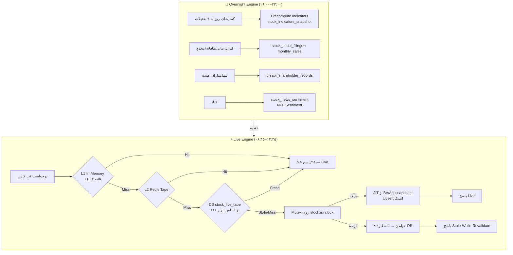

# 📈 TSE Stocks Enterprise Module — معماری دو موتوره و میکرواستراکچر

> نسخه: v2.0.0 | Migration: `0052` | قواعد: **Strictly Additive, Zero Breaking Changes**

## ۱. معماری Dual-Engine و جریان داده

- **L1 (In-Memory):** دیکشنری پروسه‌ای با TTL ۲-۵ ثانیه — مخصوص Hot Tickers.
- **L2 (Redis):** کلید `stocks:tape:{symbol}` با `SETEX` — اشتراک بین ورکرها.
- **Mutex:** همان `DistributedMutex` مشترک ماژول صندوق‌ها (SETNX+Lua) روی `stock:{isin}:lock`.
- **TTL داینامیک:** خارج از ساعات بازار tape فریز می‌شود (TTL ۸ ساعت).

## ۲. اسکیمای دیتابیس (Migration 0052 — Additive)

| جدول | نقش | کلید یگانه |
|---|---|---|
| `symbols` (+ ستون‌های nullable: `isin, market_segment, trading_state, industry_name, base_volume, free_float_pct, price_range_pct`) | هویت و کشف خودکار | `code` موجود + index `isin` |
| `stock_live_tape` | اسنپ‌شات زنده تابلو + ۵ مظنه JSON | PK `symbol` (upsert) |
| `stock_order_book_l2` | دفتر سفارشات L2 + OBI | `(symbol, captured_at)` |
| `stock_indicators_snapshot` | اندیکاتورهای پیش‌محاسبه شبانه | `(symbol, trade_date)` |
| `stock_quant_signals` | تاریخچه سیگنال ۵لایه | `(symbol, signal_date)` |
| `stock_news_sentiment` | اخبار + سنتیمنت NLP | ایندکس `(symbol, published_at)` |
| `stock_monthly_sales_production` | فروش ماهانه کدال MoM/YoY | `(symbol, year, month, product)` |
| `market_macro_indicators` | دلار نیما/آزاد، اخزا، رژیم | `indicator_date` |

## ۳. موتورهای محاسباتی

### ۳-۱. تابلوخوانی (`services/stock_tape_engine.py`)
- **قدرت خریدار (فرمول TSE):** `(VolBuy/CntBuy)/(VolSell/CntSell) × min(1, VolTotal/BaseVol)`
- **سرانه:** `Value/(Count×10⁷)` میلیون تومان
- **پول هوشمند:** سرانه خرید ≥ ۵× سرانه فروش + ارزش ≥ ۱۰۰ م.تومان → `inflow`
- **رنج‌کشی:** `Δ=(Last−Close)/Close` — ≥±۳٪ دستکاری
- **OBI:** `(ΣBid−ΣAsk)/(ΣBid+ΣAsk)` پنج سطح؛ **Slippage Simulator** چند سطحی
- **حجم مشکوک:** `Vol > μ+3σ` یا `>3×μ` نسبت به ۲۰ روز

### ۳-۲. تکنیکال (`services/stock_technical_engine.py`)
- RSI(14) با Wilder + واگرایی‌های `RD+/RD-/HD+/HD-` بر پایه اکسترمم محلی
- MACD(12,26,9) + کراس سیگنال | EMA 20/50/100/200 + Golden/Death
- Ichimoku کامل (شیفت ۲۶، Kumo Twist، TK Cross) | BB(20,2)+Keltner → Squeeze
- ATR(14) Wilder | MFI(14) | VWAP روزانه/لنگردار | Pivots: Classic/Camarilla/Fibonacci
- همگرایی MTF (Daily/Weekly EMA ساختار) → Trend Alignment Score

### ۳-۳. سیگنال کوانت (`services/stock_signal_engine.py`)
- `Score = 0.35·Tape + 0.25·Tech + 0.20·Fund + 0.10·Peer + 0.10·Macro`
- وزن‌ها بر اساس رژیم بازار (`high_volume/eroding/falling`) تغییر می‌کنند
- حد ضرر: `max(Support, Entry − 2.5×ATR14)` | تارگت‌ها: فیبوناچی ۰.۶۱۸/۱/۱.۶۱۸
- **R/R Filter:** خرید با R/R < ۲.۵ → تنزل به `hold`
- **Fractional Kelly:** `f*=(p(b+1)−1)/b×0.5` با سقف ۱۰٪ پرتفوی

## ۴. قرارداد API (`/stocks/v2` — نگاشت ۹ تب)

| تب | Endpoint |
|---|---|
| ۱ تابلو ۳۶۰ | `GET /{symbol}/tape` |
| ۲ تکنیکال | `GET /{symbol}/indicators` |
| ۳ صنعت/هم‌گروه | `GET /{symbol}/peers` |
| ۴ شناسنامه | `GET /{symbol}/dossier` |
| ۵ کدال | `GET /{symbol}/codal?category=` |
| ۶ اخبار/سنتیمنت | `GET /{symbol}/news` |
| ۷ تاریخچه | `GET /{symbol}/history?adjusted=` + `/history/export.csv` |
| ۸ پروفایل حجم | `GET /{symbol}/volume-profile` |
| ۹ نبض بازار | `GET /market-pulse` |
| کارت سیگنال | `GET /{symbol}/signal` (persist روزانه idempotent) |

## ۵. فرانت‌اند

- `frontend/src/components/StockIntelligencePanel.tsx` — ۹ تب + کارت سیگنال همیشه‌نمایان.
- هر تب `useQuery` مستقل با `enabled` شرطی (لود تنبل) + Skeleton؛ تب ۱ با `refetchInterval: 5s` زنده.
- اتصال: بالای صفحه `/symbol/[symbol]` — بدون رفرش و بدون ریدایرکت.

## ۶. تست و پایش

- **تست‌ها:** ۴۰ تست جدید (فرمول‌های تابلو با اعداد دقیق، Ichimoku insufficient-data، Kelly cap، R/R filter، no-look-ahead stop<entry).
- **P1:**
  - [ ] Cron شبانه precompute اندیکاتورها برای کل بازار
  - [ ] NLP سنتیمنت واقعی (کلیدواژه‌های توقف/خوراک/معافیت) به‌جای placeholder
  - [ ] Prometheus: `stocks_tape_cache_hit_ratio`, `stocks_signal_latency_ms`, `provider_error_rate`
  - [ ] Wash-trading detection (همبستگی زمانی کدها) — نیازمند تیک‌های شناسه‌دار
